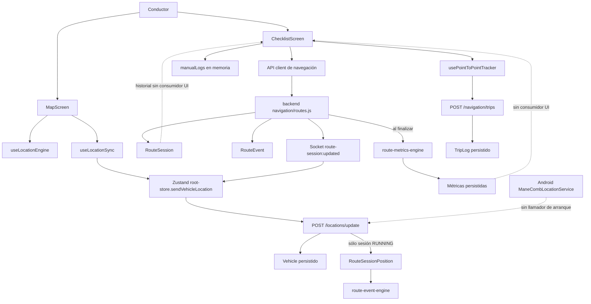

# RC-CONTROL-CERTIFICATION-01

## Auditoría integral de certificación del módulo Control

**Fecha de auditoría:** 2026-07-15 (America/Mexico_City)  
**Repositorio auditado:** `C:\proyectos\combis-app`  
**Alcance:** aplicación `mobile`, API `backend` y Android nativo relacionados con Checklist, rutas, jornadas, GPS, seguimiento e historial.  
**Método:** trazabilidad estática de código + pruebas automatizadas no destructivas. No se modificó código de producto. Este informe es el único archivo creado.

> **Condición de reproducibilidad:** el árbol de trabajo ya contenía cambios sin commit en `backend/src/data/mongo-store.js`, `backend/src/data/store.js`, `mobile/src/api/client.ts`, `mobile/src/screens/checklist-screen.tsx` y otros archivos. El dictamen corresponde al contenido exacto disponible durante la auditoría, no a un commit limpio identificable.

## 1. Dictamen ejecutivo

### Resultado global: 🔴 NO CERTIFICADO PARA PRODUCCIÓN

El backend dispone de un núcleo persistente y probado para jornadas, posiciones, eventos, checkpoints y métricas. La aplicación móvil, sin embargo, no integra ese núcleo de extremo a extremo. Los bloqueadores demostrados son:

1. **El tracking GPS persistente no acompaña la jornada fuera de Mapa.** `useLocationSync` sólo se monta en `MapScreen` (`mobile/src/screens/map-screen.native.tsx:338-346`). La navegación a Checklist cambia de módulo mediante un reset (`mobile/src/navigation/router.tsx:103-123`), por lo que el emisor se desmonta. Checklist obtiene coordenadas locales (`mobile/src/screens/checklist-screen.tsx:1273`) pero no llama `sendVehicleLocation`.
2. **El servicio Android de background existe pero nunca se inicia desde JavaScript.** `startBackgroundLocationServiceAsync` sólo está declarado en `mobile/src/native/background-location.ts:22-46`; la búsqueda global no encontró consumidores. El store únicamente importa y ejecuta la detención en cierre de sesión (`mobile/src/store/root-store.ts:67,1429`). Por tanto, app cerrada/segundo plano no está conectada al flujo de jornada.
3. **El historial principal de Checklist no es historial persistido de jornadas.** `manualLogs` es `useState([])` (`mobile/src/screens/checklist-screen.tsx:1283`), se modifica sólo en memoria al finalizar (`1516-1549`) y alimenta “Registros operativos” (`1498-1513`, `2046-2157`). Se pierde al desmontar o cerrar la app.
4. **La pantalla final presenta métricas planificadas como resultado.** El resumen usa `routeOption.distanceMeters`, duración estimada y cantidad de paradas configuradas (`1518-1525`, `2461-2473`), no las métricas calculadas y persistidas de la jornada.
5. **Los endpoints móviles de métricas, eventos, checkpoints e historial de sesiones son código sin consumidor.** Sólo están declarados en `mobile/src/api/client.ts:920-960`; no existe otra referencia en `mobile/src`.
6. **Editar una ruta guardada no está integrado.** El backend expone `PATCH /navigation/routes/:routeId` (`backend/src/modules/navigation/routes.js:294-362`), pero el cliente no ofrece request PATCH. “Cambiar ruta” únicamente desasigna la ruta (`mobile/src/screens/checklist-screen.tsx:2012-2026,2361-2364`).
7. **Hay un control interactivo sin acción.** El preview durante navegación recibe `onPress={() => undefined}` (`mobile/src/screens/checklist-screen.tsx:2377-2382`).

La existencia y éxito de pruebas backend no compensa estos cortes de integración. El módulo no cumple el flujo funcional completo solicitado.

## 2. Escala de certificación

- 🟢 **Certificada:** implementación conectada, persistente y cubierta por evidencia ejecutable.
- 🟡 **Parcial:** existe lógica real, pero falta integración, cobertura de escenario o presentación fiel.
- 🔴 **No implementada:** no existe evidencia ejecutable del requisito en el producto.
- ⚫ **Código muerto:** existe código/API sin consumidor o una acción explícitamente inerte.

## 3. Inventario y arquitectura real

### 3.1 Inventario

| Capa | Artefacto | Responsabilidad demostrada | Estado |
|---|---|---|---|
| Screen | `mobile/src/screens/checklist-screen.tsx` / `ChecklistScreen` | UI de registros, creación/asignación de rutas y comandos de jornada | 🟡 |
| Screen | `mobile/src/screens/map-screen.native.tsx` / `MapScreen` | Mapa Mapbox, selector, ubicación foreground, envío GPS y accesos rápidos de jornada | 🟡 |
| Screen web | `mobile/src/screens/map-screen.web.tsx` | Variante web de mapa | 🟡 |
| Hook | `mobile/src/hooks/use-point-to-point-tracker.ts` | Estado local de ruta/vuelta, progreso, llegada y TripLog | 🟡 |
| Core | `mobile/src/hooks/point-to-point-tracker-core.ts` | Distancia, zonas, transición inicio/fin y snap-to-route | 🟢 (unidad) |
| Hook | `mobile/src/screens/map/hooks/use-location-engine.ts` | Permisos y watcher GPS foreground | 🟡 |
| Hook | `mobile/src/screens/map/hooks/use-location-sync.ts` | Sincroniza coordenadas hacia el store/API mientras Mapa está montado | 🟡 |
| Store | `mobile/src/store/root-store.ts` | Sesión de usuario, mapa, socket, caché/offline y `activeRouteSession` | 🟡 |
| Stores fachada | `mobile/src/store/session/session-store.ts`, `location/location-store.ts`, `fleet/fleet-store.ts` | Selectores del root store; no son stores independientes | 🟢 |
| API móvil | `mobile/src/api/client.ts:800-1004` | Vehículos, ubicaciones, planeación, rutas, sesiones y TripLogs | 🟡 |
| Navegación | `mobile/src/navigation/route-registry.ts:24-33` | Registra `/mapa`, `/checklist`, incidencias, chat y radio | 🟢 |
| Navegación | `mobile/src/navigation/router.tsx:83-132` | Reset al entrar/cambiar de módulo | 🟢; afecta continuidad GPS |
| Mapbox | `mobile/src/components/app-map.native.tsx`; `app-map.web.tsx` | Render de mapa/polyline; SDK `@rnmapbox/maps` y `mapbox-gl` | 🟡 |
| GPS nativo | `mobile/src/native/location.ts` | Permisos y geolocalización foreground/background | 🟡 |
| Background bridge | `mobile/src/native/background-location.ts` | Puente al servicio Android | ⚫ sin arranque |
| Android service | `mobile/android/.../location/ManeCombLocationService.kt` | Foreground service, cola local, reintento y POST de ubicaciones | ⚫ desconectado |
| Android boot | `ManeCombBootReceiver.kt` | Restaura configuración persistida del servicio | ⚫ no puede activarse sin inicio previo |
| API backend | `backend/src/modules/navigation/routes.js` | Buscar, planear, CRUD de rutas, asignar, sesiones, métricas e historial | 🟢 backend / 🟡 producto |
| API backend | `backend/src/modules/locations/routes.js` | Actualiza unidad, persiste posición de sesión RUNNING y procesa eventos | 🟢 backend / 🟡 producto |
| Motor | `backend/src/services/route-event-engine.js` | GPS perdido, desvío, movimiento y checkpoints | 🟢 backend |
| Motor | `backend/src/services/route-metrics-engine.js` | Distancia, tiempos, velocidades, GPS, paradas y vueltas | 🟢 backend |
| Persistencia | `backend/src/data/models.js:201-375` | Vehicle, RouteSession, Position, RouteEvent y CheckpointVisit | 🟢 Mongo |
| Persistencia alternativa | `backend/src/data/store.js` | Store en memoria usado por pruebas/desarrollo | 🟢 para su alcance |
| Persistencia Mongo | `backend/src/data/mongo-store.js` | Operaciones persistentes equivalentes | 🟡 no validada contra Mongo real en esta auditoría |
| Socket | `backend/src/modules/navigation/routes.js:582-583,640-641`; `mobile/src/store/root-store.ts:1086-1089` | Emite/consume `route-session:updated` | 🟢 |
| Session | `mobile/src/store/root-store.ts`; `backend/src/services/sessions.js` | Autenticación, recuperación y limpieza | 🟡 en alcance Control |

### 3.2 Diagrama lógico observado

Hay dos conceptos paralelos no unificados:

- **Jornada (`RouteSession`)**: comienza/pausa/finaliza explícitamente y genera métricas backend.
- **Vuelta (`TripLog`)**: se inicia/termina por geocerca local en `usePointToPointTracker` y guarda distancia planificada.

Checklist mezcla ambos en la experiencia, pero su “Historial” superior usa un tercer estado (`manualLogs`) exclusivamente local.

## 4. Flujo real del conductor, paso a paso

| Paso requerido | Evidencia real | Store / endpoint / persistencia / pantalla | Clasificación |
|---|---|---|---|
| Ingreso al módulo | `/checklist` registrado en `route-registry.ts:30`; menú en `desktop-navigation.ts:84-89` | Router cambia al módulo Checklist | 🟢 |
| Unidad asignada | `user.vehicleId`, `Vehicle.driverId`; validación backend al iniciar (`navigation/routes.js:557-560`) | User/Vehicle persistidos; Checklist selecciona una unidad (`checklist-screen.tsx:1304-1305`) | 🟡: UI no restringe aquí al vehículo del conductor |
| Ruta asignada | `assignSavedRoute` llama `POST /navigation/assign` (`1745-1765`) | Vehicle `routeId/assignedRoute`; `refreshAll`; UI ready | 🟢 |
| Selección de ruta | lista `mapData.routes` y `assignSavedRoute` (`2183-2203`) | API/store/backend/UI conectados | 🟢 |
| Inicio de jornada | `startTrip` → `POST /navigation/sessions/start` (`1575-1588`; client `903-906`) | RouteSession persistida; estado local `activeSession`; evento/socket backend | 🟡: no inicia servicio background |
| Registro de hora | Backend fija `startedAt = new Date()` (`navigation/routes.js:567`) | RouteSession Mongo/in-memory; UI tracker restaura hora pero no la muestra como métrica histórica | 🟡 |
| Inicio de tracking | `restoreTrackerSession` fuerza `in_progress` (`use-point...:519-536`) | Estado React del hook, no store persistente | 🟡 |
| GPS | `useLocationEngine` observa GPS (`use-location-engine.ts:52-177`) | Sólo sincroniza desde MapScreen (`map-screen.native.tsx:338-346`) | 🔴 para jornada continua |
| Paradas | UI configura `pointStops`; backend infiere checkpoints desde `activeRouteProgress` (`route-event-engine.js:265-314`) | Configuración de ruta persistida; visits persistidas si llegan posiciones | 🟡 |
| Kilómetros | Backend calcula Haversine de posiciones (`route-metrics-engine.js:161-168,202,210`) | RouteSession métricas persistidas; UI final usa distancia planeada | 🟡 |
| Tiempo | Backend `totalDuration` inicio-fin y eventos (`route-metrics-engine.js:188-215`) | Persistido; no consumido en UI Control | 🟡 |
| Incidencias | Store y endpoints propios (`root-store.ts:239-240,1603+`; `backend/src/modules/incidents/routes.js`) | Se reflejan en Mapa/Incidencias | 🟡: no hay enlace automático a RouteSession/evento de jornada |
| Pausa | `toggleSessionPause` → PATCH status (`1590-1602`) | RouteSession PAUSED, evento, socket; tracker local pausado | 🟡 |
| Reanudación | mismo handler cambia a RUNNING | Persistencia/evento/socket reales | 🟡 |
| Finalización | `finishTrip` → PATCH FINISHED (`1516-1573`) | RouteSession final + cálculo síncrono de métricas | 🟡: resumen UI no usa resultado real |
| Guardado | Jornada backend sí; `manualLogs` no; TripLog sólo al detectar llegada local | Tres persistencias/estados divergentes | 🟡 |
| Historial | `getNavigationTripLogsRequest` consume TripLogs (`use-point...:574-626`) | El “Historial” principal no los usa; sesiones/métricas tampoco | 🔴 como historial integral |

## 5. Inicio, pausa y finalización

### 5.1 Inicio de jornada — 🟡 Parcial

Evidencia positiva:

- `startTrip` impide doble envío local con `activeSession || isChangingSession` (`checklist-screen.tsx:1575-1577`).
- Backend exige ruta y conductor, y autoriza al conductor asignado (`navigation/routes.js:557-560`).
- `createRouteSession` usa una clave activa única; el test demuestra segundo inicio idempotente: primer POST 201, segundo 200 (`backend/test/route-sessions.test.js`).
- Se persisten inicio, odómetro inicial, batería, precisión y metadatos si se suministran (`navigation/routes.js:562-575`; modelo `models.js:250-257,284-290`).
- Se registra `SESSION_STARTED` y se emite socket (`navigation/routes.js:576-585`).

Límites:

- Cliente sólo envía `vehicleId` (`client.ts:903-906`): no envía odómetro, batería, precisión ni deviceInfo.
- Offline no está soportado para start: `startTrip` captura error y muestra mensaje; no encola operación (`checklist-screen.tsx:1578-1587`).
- No inicia `ManeCombLocationService` ni asegura envío GPS tras cambiar de pantalla.
- El store global no se actualiza directamente en `startTrip`; depende de estado local y socket.

### 5.2 Pausa y reanudación — 🟡 Parcial

Evidencia positiva:

- Transiciones backend válidas: RUNNING→PAUSED/FINISHED/CANCELLED y PAUSED→RUNNING/FINISHED/CANCELLED (`navigation/routes.js:592-603`).
- Actualización condicional `expectedStatus` evita carreras (`605-615`).
- Se persisten y emiten `SESSION_PAUSED` / `SESSION_RESUMED` (`619-641`).
- `/locations/update` sólo crea posiciones cuando la sesión está RUNNING (`locations/routes.js:131-152`), por lo que PAUSED excluye datos de métricas.
- El hook conserva y restaura estado local pausado (`use-point...:455-517`).

Límites:

- El cronómetro mostrado no es un cronómetro persistente de jornada; la UI expone ETA/progreso calculado, no duración activa descontando pausa.
- El cálculo backend de `totalDuration` usa inicio-fin y `movingTime = totalDuration - stoppedTime`; no descuenta los intervalos `SESSION_PAUSED` (`route-metrics-engine.js:188-215`). Por tanto, una pausa aumenta tiempo total y potencialmente tiempo en movimiento si no existe un evento de parada equivalente.
- Pausa/reanudación offline no se encola.
- `tracker.toggleTracker()` ocurre después del PATCH; coherencia básica sí, persistencia del estado local no.

### 5.3 Finalización — 🟡 Parcial

Evidencia positiva:

- Backend persiste `finishedAt`, estado terminal, razón y actor (`navigation/routes.js:604-615`).
- Repetir el mismo estado terminal es idempotente y otro estado retorna conflicto (`598-603`).
- Registra `SESSION_FINISHED`, calcula y persiste métricas y emite socket (`619-641`).
- El test backend verifica doble final, eventos, posiciones, checkpoints, historial y métricas.

Límites críticos:

- Cliente no envía odómetro final, batería, precisión o razón (`client.ts:908-918`).
- `finishTrip` crea/modifica `manualLogs` **antes** de confirmar el PATCH (`checklist-screen.tsx:1516-1549`). Si falla backend, la lista visual ya puede mostrar completado aunque la jornada siga activa.
- Si la unidad no tiene ruta asignada, `finishTrip` retorna tras producir sólo un final visual/local (`1551-1556`), sin persistencia de sesión.
- El resumen se arma antes de la respuesta y usa valores planificados (`1518-1526`).
- No carga `getRouteSessionMetricsRequest`; no informa fallo de procesamiento ni estadísticas reales.
- Finalización offline no se encola.

## 6. Rutas

| Capacidad | Evidencia | Resultado |
|---|---|---|
| Crear | UI `saveAssignedRoute` → `createNavigationRouteRequest` → POST `/navigation/routes`, luego assign (`checklist-screen.tsx:1702-1743`; backend `routes.js:238-292`) | 🟢 |
| Editar geometría/nombre persistido | Backend PATCH existe (`routes.js:294-362`) | ⚫ cliente sin función/consumidor |
| “Cambiar ruta” | `editAssignedRoute` ejecuta DELETE de asignación (`checklist-screen.tsx:2012-2026`) | 🟡 etiqueta no equivale a editar |
| Eliminar | UI con confirmación → DELETE (`1767-1791`); backend limpia asignaciones (`routes.js:364-413`) | 🟢 |
| Seleccionar/asignar | `assignSavedRoute` → POST assign (`1745-1765`; backend `415-476`) | 🟢 |
| Desasignar | `clearAssignedVehicleRouteRequest` (`client.ts:889-893`) y endpoint backend (`routes.js:478-526`) | 🟢 |
| Guardar | RouteModel/Vehicle persistentes; `refreshAll` refresca UI | 🟢 |
| Protección de jornada activa | Backend bloquea asignar/quitar/eliminar cuando corresponde (`routes.js:440,503` y pruebas) | 🟢 |
| Sincronización realtime | Asignación/rutas dependen principalmente de `refreshAll`; no se evidenció evento dedicado de ruta consumido por móvil | 🟡 |

## 7. GPS, Mapbox y tracking

| Requisito | Evidencia | Clasificación |
|---|---|---|
| Posición foreground | `useLocationEngine` pide permisos, posición actual y watcher (`52-177`) | 🟢 mientras screen montada |
| Filtro de precisión | `shouldAcceptLocation`, `MAX_ACCEPTED_ACCURACY_METERS`; pruebas de location-service pasan | 🟢 |
| Envío al backend | `useLocationSync` en MapScreen y `sendVehicleLocation` → POST `/locations/update` | 🟡 condicionado a Mapa |
| Cola offline foreground | `root-store.ts:1551-1559` encola `vehicle:location`; `flushPendingSync` reintenta | 🟢 para ese emisor |
| Background Android | Servicio real con foreground notification, cola y reconexión (`ManeCombLocationService.kt:37-122` y siguientes) | ⚫ no se inicia |
| App cerrada/reinicio | `ManeCombBootReceiver` intenta restaurar config | ⚫ inalcanzable sin config inicial |
| Pausa | Backend no persiste posiciones PAUSED (`locations/routes.js:131-152`) | 🟢 backend |
| Reconexión | Store y servicio nativo tienen colas/reintentos | 🟡 sólo rutas efectivamente activadas |
| Mapbox | Dependencias y componentes nativo/web reales; polyline usada en RoutePreview/MapCanvas | 🟢 render |
| Polyline/progreso | `point-to-point-tracker-core.ts` y test “snap-to-route” | 🟢 lógica local |
| GPS perdido | Motor infiere huecos entre posiciones (`route-event-engine.js:157-183`) | 🟡 no detecta pérdida definitiva sin una posición posterior |
| Simulación | No se encontró mock GPS en producción; sí fixtures/mocks en tests | 🟢 no simulado en producción |

## 8. Métricas

| Métrica | Origen/cálculo | Persistencia | Pantalla Control | Estado |
|---|---|---|---|---|
| Hora inicio | servidor al crear sesión (`navigation/routes.js:567`) | RouteSession.startedAt | no se muestra como historial real | 🟡 |
| Hora fin | servidor al cerrar (`routes.js:608`) | RouteSession.finishedAt | muestra `new Date()` local del resumen (`checklist:1522`) | 🟡 |
| Tiempo detenido | pares VEHICLE_STOPPED/MOVING (`route-metrics-engine.js:193`) | RouteSession.stoppedTime | no consumido | 🟡 |
| Tiempo en movimiento | total menos detenido (`203-204`) | RouteSession.movingTime | no consumido | 🟡; pausa no descontada |
| Kilómetros | Haversine de posiciones (`161-168,202`) | RouteSession.totalDistance | resumen usa distancia planeada | 🟡 |
| Velocidad media/máxima | posiciones (`196,219-220`) | RouteSession | no consumido | 🟡 |
| Paradas | eventos por velocidad y umbral (`route-event-engine.js:213-263`) | eventos + stopEvents | UI muestra stops configurados | 🟡 |
| Tiempo total | startedAt→finishedAt (`192`) | RouteSession.totalDuration | no consumido; UI usa estimado | 🟡 |
| ETA | duración planificada/tráfico (`checklist:1476-1485`) | ruta asignada | sí, durante navegación | 🟢 como estimación, no llegada real |
| Llegada | geocerca local genera TripLog (`use-point...:667-731`) | TripLog | historial de vueltas dentro del tracker; registro superior usa manualLogs | 🟡 |
| Combustible | `Vehicle.fuel` en modelo (`models.js:217`) | Vehicle | no se usa en Control | 🔴 para Control |
| GPS perdido/desvío/checkpoints | event engine + metrics engine | RouteEvent/CheckpointVisit/RouteSession | no consumido tras jornada | 🟡 |

## 9. Integraciones

| Integración | Flujo seguido | Dictamen |
|---|---|---|
| Mapa | Checklist abre `/mapa` con parámetros; MapSelector devuelve selección; Mapbox renderiza | 🟢 para diseñar ruta |
| Vehículos | `mapData.vehicles`, endpoints locations/assign y Vehicle persistente | 🟢 |
| Usuarios/conductor | driverId/vehicleId validados en backend; cambios bloqueados con jornada activa | 🟢 backend |
| Backend | Requests reales para rutas/sesiones/trips/locations | 🟡 integración incompleta de métricas/background |
| Socket | backend emite y root-store consume `route-session:updated`; location también actualiza mapa | 🟢 |
| Incidencias | Store/endpoints/socket propios y mapa las refleja | 🟡 no se asocian automáticamente a sessionId ni a RouteEvent |
| Chat | Accesible como módulo y comparte sesión/socket | 🔴 sin enlace funcional con jornada/ruta en Control |
| Radio | Accesible como módulo; implementación propia | 🔴 sin enlace funcional con jornada/ruta en Control |

Un import, menú común o socket compartido no constituye integración operativa de la jornada; por ello Chat y Radio se clasifican como no implementados dentro del flujo Control.

## 10. Código muerto, desconectado y acciones inertes

### ⚫ Confirmado

1. `startBackgroundLocationServiceAsync` (`mobile/src/native/background-location.ts:22`) no tiene consumidores.
2. El servicio `ManeCombLocationService` y el boot receiver son funcionalmente inaccesibles desde el flujo actual por falta de arranque inicial.
3. `getRouteSessionMetricsRequest`, `getRouteSessionHistoryRequest`, `recalculateRouteSessionMetricsRequest`, `getRouteSessionEventsRequest` y `getRouteSessionCheckpointVisitsRequest` (`mobile/src/api/client.ts:920-960`) no tienen consumidores móviles.
4. Backend `PATCH /navigation/routes/:routeId` no tiene cliente móvil.
5. `RoutePreview` en navegación usa `onPress={() => undefined}` (`checklist-screen.tsx:2381`).

### No se confirmó como código muerto

- Los endpoints backend de sesiones/métricas sí están cubiertos por `backend/test/route-sessions.test.js` y son ejecutables por API, aunque la app no los consuma.
- Los mocks encontrados están limitados a pruebas Jest; no se hallaron simuladores GPS en código productivo.
- No se encontraron marcadores TODO/FIXME relevantes en el alcance productivo.

## 11. UX funcional

Hallazgos documentados, sin propuesta de rediseño:

1. **“Historial” no corresponde a datos históricos persistidos.** El filtro `all` lleva etiqueta “Historial” (`checklist-screen.tsx:2048`) pero renderiza registros derivados de Vehicle + `manualLogs` (`1498-1513`).
2. **“Cambiar ruta” desasigna, no edita.** Etiqueta en `2361-2364`; acción real en `2012-2026`.
3. **Resumen final semánticamente incorrecto.** Presenta “Distancia”, “Paradas” y “Estimado” planificados como resumen de ruta finalizada (`2455-2473`).
4. **“Ver paradas” no abre lista/vista dedicada.** Sólo concatena etiquetas en un mensaje (`2413-2421`).
5. **Preview activo clickeable sin efecto.** `onPress={() => undefined}` (`2381`).
6. **Duplicidad conceptual.** “Registros operativos”, historial de TripLogs y RouteSession history representan tres fuentes distintas sin reconciliación.
7. **Flujo Mapa→Checklist rompe el emisor GPS.** Es un defecto funcional de navegación, no cosmético.

No hay evidencia objetiva en código para afirmar qué elementos “ya se había decidido eliminar”; sin especificación o issue enlazado se marca **NO DETERMINABLE**, no se infiere.

## 12. Robustez

| Escenario | Evidencia | Estado |
|---|---|---|
| Sin internet: ubicación | root-store encola `vehicle:location` (`1551-1559`) | 🟢 sólo foreground activo |
| Sin internet: inicio/pausa/final | handlers directos capturan error, sin cola | 🔴 |
| Reconexión | network subscription/flush y socket reconnect en root-store; cola nativa en servicio | 🟡 servicio nativo desconectado |
| Doble inicio/final | backend idempotente/condicional; test pasa | 🟢 |
| Doble clic UI | `isChangingSession` protege inicio/pausa; el slider puede disparar antes del rerender, backend protege | 🟡 |
| Rotación | `useWindowDimensions` adapta layout (`checklist:1270-1272`) | 🟡 no existe prueba de rotación/estado modal |
| Cambio de usuario | signOut limpia estado/cache y detiene background (`root-store:282-294,1429`) | 🟢 limpieza; servicio nunca arrancó |
| Error backend | mensajes genéricos; refresh/cache en store | 🟡 puede quedar manualLog falso al finalizar |
| GPS apagado | location engine comprueba servicios y expone retry/status | 🟢 foreground |
| Permisos denegados | reducer y UI de status/retry | 🟢 foreground; no hay prueba E2E física |
| App en segundo plano | servicio Android implementado pero no iniciado | 🔴 |
| App cerrada | boot receiver depende de config nunca creada | 🔴 |
| Reanudación de jornada | GET active + `restoreTrackerSession` (`checklist:1326-1345`) | 🟡 recupera estado, no continuidad GPS/historial local |
| Pausa en métricas | posiciones no se guardan PAUSED, pero duración no descuenta pausa | 🟡 |

## 13. Evidencia de pruebas ejecutadas

### 13.1 Móvil

Comando: `npm.cmd test` en `mobile`  
Resultado: **exit 0**; 12 suites, 60 tests aprobados. Incluye:

- core punto a punto: distancia, inicio por origen, cierre único, snap-to-route y desvío;
- `checklist-screen.test.ts`;
- ubicación, navegación, radio, schedule y realtime.

Limitación: `checklist-screen.test.ts` mockea API, ubicación, router y mapa (`líneas 7-103`); no prueba GPS real, background, persistencia Mongo ni viaje E2E.

### 13.2 TypeScript

Comando: `npm.cmd run typecheck` en `mobile`  
Resultado: **exit 0**.

### 13.3 Backend jornadas

Comando: `node --require ./test/setup-env.js test/route-sessions.test.js`  
Resultado: **exit 0**; demostró doble inicio idempotente, bloqueo de reasignación/cambio de chofer, pausa/reanudación, posiciones, eventos, checkpoints, final idempotente, métricas, historial y recálculo.

### 13.4 Backend vueltas

Comando: `node --require ./test/setup-env.js test/navigation-trips.test.js`  
Resultado: **exit 0**; demostró filtro por unidad/fecha e idempotencia de duplicados exactos.

### 13.5 Evidencia no ejecutada/no disponible

- dispositivo físico con permisos y GPS real;
- ciclo background/app cerrada/reboot;
- MongoDB real;
- pérdida/reconexión de red durante una jornada completa;
- integración E2E Mapa→Checklist→GPS→final→historial;
- iOS background (no existe servicio equivalente evidenciado).

Estos puntos no se certifican por ausencia de evidencia.

## 14. Matriz final de funcionalidades

### 🟢 Certificadas dentro de su alcance

- Planeación backend y render de rutas Mapbox.
- Creación, asignación, desasignación y eliminación de rutas (excepto edición persistida desde móvil).
- Modelo y endpoints backend de RouteSession.
- Reglas backend de doble inicio/final y transiciones.
- Persistencia backend de posiciones RUNNING, eventos y checkpoints cuando recibe GPS.
- Cálculo backend de métricas cuando existen posiciones/eventos.
- Socket de actualización de sesión.
- Core unitario de geocerca/snap-to-route.

### 🟡 Parciales

- Inicio, pausa, reanudación y finalización desde UI.
- GPS foreground.
- Cola offline de ubicación.
- Historial de vueltas TripLog.
- Métricas de jornada: backend completo, UI desconectada.
- Incidencias y vehículos dentro del contexto operativo.
- Reanudación de una sesión activa.
- ETA, paradas y progreso.

### 🔴 No implementadas en el producto integrado

- Tracking continuo de jornada en background/app cerrada.
- Historial integral persistido de jornadas en Checklist.
- Presentación de métricas reales al finalizar.
- Edición persistida de ruta desde móvil.
- Inicio/pausa/finalización offline con reconciliación.
- Integración funcional de Chat y Radio con jornada.
- Combustible en Control.
- iOS background tracking.

### ⚫ Código muerto/desconectado

- Arranque del servicio background.
- Clientes móviles de history/metrics/events/checkpoints/recalculate.
- PATCH de edición de ruta sin cliente.
- Preview activo con handler vacío.

## 15. Riesgos

| Prioridad | Riesgo | Impacto demostrable |
|---|---|---|
| P0 | Jornada sin posiciones al salir de Mapa | métricas vacías/incorrectas, sin trazabilidad GPS |
| P0 | Servicio background nunca iniciado | pérdida total de tracking en background/app cerrada |
| P0 | Historial visual volátil | operador puede creer que existe evidencia que se pierde al desmontar |
| P0 | Resumen final usa plan, no ejecución | reporte operativo materialmente incorrecto |
| P1 | Pausas no descontadas de movingTime | métricas laborales/operativas incorrectas |
| P1 | Final visual antes de confirmación backend | divergencia UI-servidor ante error |
| P1 | Acciones de sesión sin soporte offline | jornada puede quedar abierta o con estado inconsistente |
| P1 | Tres fuentes de “viaje” | reconciliación e interpretación ambiguas |
| P2 | Edición no integrada y etiqueta engañosa | pérdida de asignación en vez de edición esperada |
| P2 | Código API sin consumidor | superficie sin valor de producto y falsa sensación de completitud |

## 16. Recomendaciones priorizadas para alcanzar certificación

Estas son condiciones de cierre, no cambios cosméticos:

1. **P0 — Unificar el ciclo de tracking con RouteSession.** Iniciar/detener el servicio background al iniciar/finalizar sesión, recuperar config al reinicio y demostrar Android físico; definir e implementar equivalente iOS o declarar plataforma no soportada.
2. **P0 — Mantener envío GPS independiente de la pantalla.** El emisor no puede depender de que MapScreen permanezca montado.
3. **P0 — Reemplazar `manualLogs` como fuente de historial.** Consumir `/navigation/sessions/history` y `/metrics`; conservar TripLog sólo si su concepto de vuelta está explícitamente separado.
4. **P0 — Mostrar métricas ejecutadas.** Tras finalizar, usar la RouteSession devuelta y/o consultar metrics; distinguir planificado vs real.
5. **P1 — Corregir semántica temporal de pausa.** Calcular y persistir tiempo pausado y excluirlo de movingTime según definición funcional.
6. **P1 — Diseñar reconciliación offline de comandos de jornada.** Idempotency keys, orden start/pause/resume/finish y resolución de conflicto servidor.
7. **P1 — Hacer atómica la UI de finalización.** No marcar completado ni mostrar resumen antes de confirmación persistente.
8. **P1 — Crear prueba E2E obligatoria.** Unidad+conductor+ruta → start → GPS → checkpoint → pause → resume → incident → finish → metrics → history, incluyendo red intermitente.
9. **P2 — Integrar PATCH de rutas o cambiar la promesa funcional.** “Editar/Cambiar” debe corresponder a la acción real.
10. **P2 — Eliminar o conectar acciones/endpoints huérfanos.** En particular preview vacío y clientes de métricas/eventos.

## 17. Decisión de salida

**El módulo Control no puede considerarse terminado para producción.**

La capacidad backend de jornadas está suficientemente implementada para continuar integración y pruebas, pero el producto móvil no demuestra seguimiento continuo, historial persistido ni métricas reales visibles. Los cuatro P0 de tracking, background, historial y resumen impiden la certificación aun cuando las pruebas automatizadas actuales estén en verde.

La recertificación requiere evidencia ejecutable del flujo E2E completo en dispositivo y base persistente, además de cerrar los P0 y P1 anteriores. Hasta entonces, cualquier afirmación de producción para el módulo integral sería incompatible con la evidencia del código auditado.
