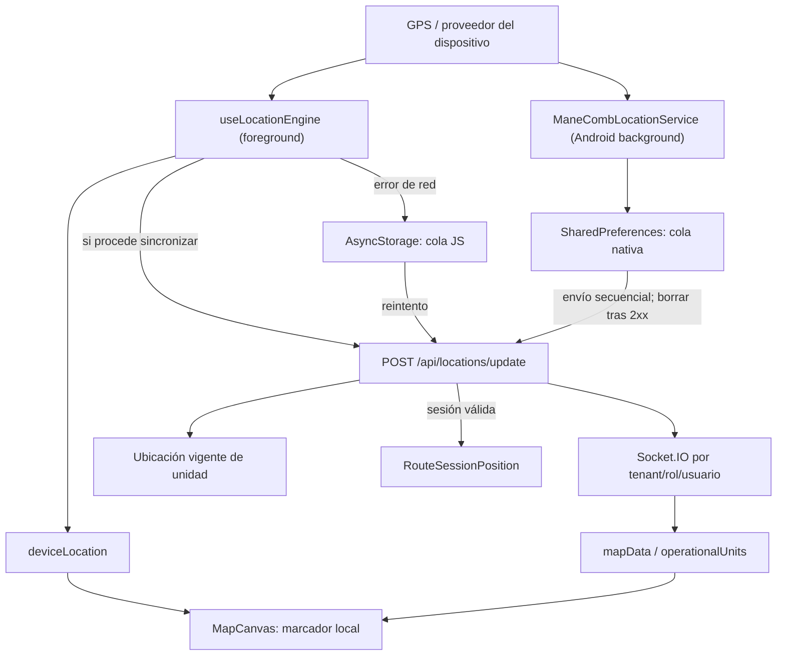
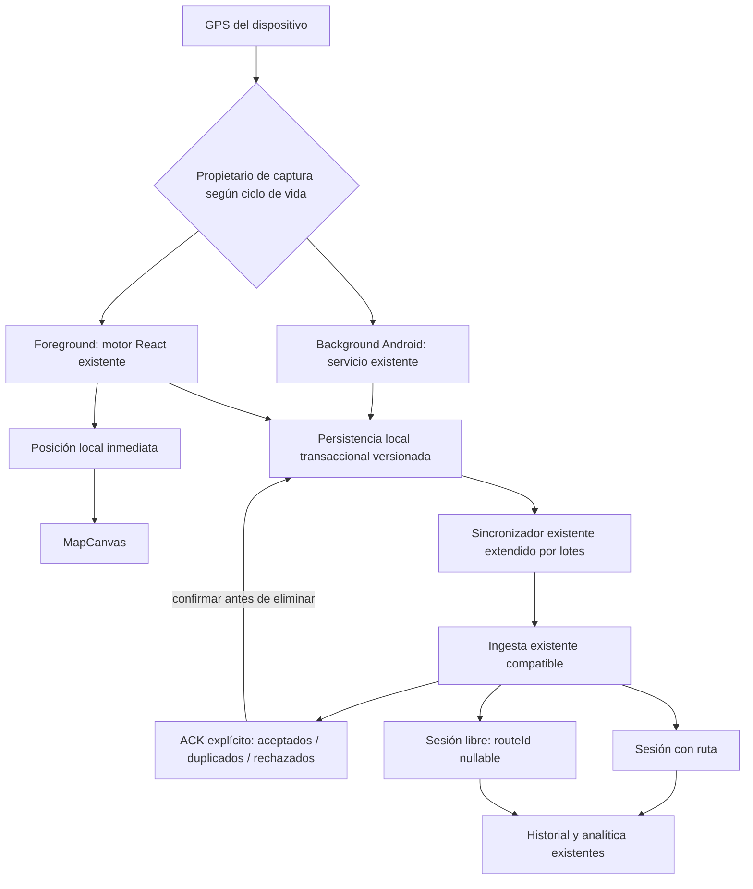

# RC-GPS-01 — Auditoría del sistema actual de seguimiento

## Estado

```text
CLOSED
```

## Objetivo

Reconstruir el funcionamiento real del seguimiento de ManeComb antes de extenderlo. La auditoría identifica cómo se captura, representa, transmite, persiste y distribuye la ubicación; qué responsabilidades ya existen; cuáles son sus fuentes de verdad; y qué trabajo mínimo corresponde a RC-GPS-02.

Esta fase no modifica lógica productiva ni introduce modelos, endpoints, colas o motores de ubicación.

## Base

- Rama: `main`.
- Commit inicial auditado: `cb4cf85`.
- Entorno: Windows, Node.js, Jest, TypeScript y pruebas de backend con almacenamiento de prueba.
- Plataformas inspeccionadas: aplicación React Native/Expo, servicio nativo Android, API REST, Socket.IO y persistencia MongoDB.
- Estado previo del árbol: existen cambios de interfaz ajenos a esta RC. No se modificaron, descartaron ni incluyeron.

## Diagnóstico encontrado

### 1. Arquitectura actual

El seguimiento no es una única tubería, sino la coordinación de cuatro capas existentes:

1. **Captura local en primer plano.** `useLocationEngine` mantiene un observador GPS independiente de la conectividad, filtra precisión y desplazamiento y actualiza `deviceLocation`.
2. **Sincronización móvil.** `useLocationSync` decide si envía según unidad, conectividad, horario e intervalo. Ante un error de red, `sendVehicleLocation` conserva el punto en la cola local.
3. **Captura nativa Android en segundo plano.** `ManeCombLocationService` usa los proveedores GPS y de red, conserva puntos pendientes en el dispositivo y reintenta su envío.
4. **Consolidación en backend.** `/api/locations/update` autentica, aplica tenant y permisos, actualiza la ubicación vigente de la unidad, asocia el punto a una sesión cuando corresponde, protege duplicados y publica eventos.

`MapCanvas` no espera una confirmación del backend para mover el marcador del dispositivo. Recibe las coordenadas locales por props y representa por separado las unidades operativas provenientes del servidor.

### 2. Archivos relevantes

#### Aplicación móvil

| Archivo o módulo | Responsabilidad observada |
|---|---|
| `mobile/App.tsx` | Montaje global del motor, sincronización, permisos y arranque/parada del servicio Android |
| `mobile/src/screens/map/hooks/use-location-engine.ts` | Observación GPS en foreground y estado local |
| `mobile/src/screens/map/services/location-service.ts` | Permisos, proveedor, posición actual y watcher |
| `mobile/src/screens/map/hooks/use-location-sync.ts` | Puente no bloqueante entre posición local y sincronización |
| `mobile/src/screens/map/utils/tracking.ts` | Reglas de envío por conexión, horario, unidad e intervalo |
| `mobile/src/screens/map/components/MapCanvas.tsx` | Marcador local, unidades operativas, ruta y capas del mapa |
| `mobile/src/store/root-store.ts` | Estado operativo, envío, cola, sockets y recuperación de caché |
| `mobile/src/api/offline-cache.ts` | Snapshot y cola offline en AsyncStorage |
| `mobile/src/services/route-session-actions.ts` | Inicio y transiciones de sesión con soporte offline |
| `mobile/src/native/background-location.ts` | Contrato TypeScript con el servicio nativo |
| `mobile/android/app/src/main/java/**/ManeCombLocationService.kt` | Captura y sincronización Android en segundo plano |
| `mobile/android/app/src/main/java/**/ManeCombBootReceiver.kt` | Restauración tras reinicio o actualización del paquete |
| `mobile/android/app/src/main/AndroidManifest.xml` | Permisos y registro del servicio/receiver |

#### Backend

| Archivo o módulo | Responsabilidad observada |
|---|---|
| `backend/src/modules/locations/routes.js` | Ingesta, validación, pertenencia, tiempo, persistencia y publicación |
| `backend/src/modules/navigation/routes.js` | Inicio, estado, consulta e historial de sesiones |
| `backend/src/data/mongo-store.js` | Persistencia e idempotencia de sesiones y posiciones |
| `backend/src/data/models.js` | `RouteSession`, `RouteSessionPosition`, eventos, visitas y viajes |
| `backend/src/services/tracking/` | Adaptadores y procesamiento operativo existente |
| `backend/src/middlewares/` | Autenticación, tenant, acceso operativo y rate limit |
| `backend/src/socket/` y emisores relacionados | Distribución por organización, rol, usuario y administrador |

### 3. Flujo actual de ubicación

#### Primer plano

1. La aplicación solicita y verifica permisos.
2. El watcher recibe una coordenada.
3. El motor descarta puntos que exceden la precisión admitida o no cumplen el desplazamiento mínimo.
4. El punto aceptado actualiza inmediatamente `deviceLocation`.
5. `MapCanvas` mueve el marcador local con ese estado.
6. En paralelo, `useLocationSync` evalúa si corresponde enviar.
7. Si hay red y se cumplen las reglas, se llama a `/api/locations/update`.
8. Si el fallo es de red, el punto se encola en AsyncStorage.
9. El backend actualiza la ubicación vigente y, cuando existe una sesión válida, su historial.
10. Socket.IO distribuye la actualización a las audiencias autorizadas.

#### Segundo plano Android

1. `App.tsx` inicia el servicio únicamente con autenticación, unidad y condiciones operativas válidas.
2. Para un conductor se exige actualmente una sesión `RUNNING`.
3. El servicio nativo recibe puntos de GPS o red, genera un `packetId` UUID y los guarda en SharedPreferences.
4. Intenta enviarlos secuencialmente; elimina cada punto local solo después de HTTP 2xx.
5. En 401/403 intenta renovar el token una vez.
6. Ante indisponibilidad aplica backoff entre 5 y 60 segundos.
7. Si falta una sesión real, intenta iniciar una mediante la API antes de drenar.
8. `BootReceiver` puede restaurar el servicio si quedó habilitado y conserva configuración válida.

### 4. Fuentes de verdad

| Estado | Fuente de verdad | Proyecciones o cachés |
|---|---|---|
| Ubicación inmediata del dispositivo | Lectura aceptada por `useLocationEngine` o servicio nativo según estado de ejecución | `deviceLocation` en Zustand |
| Ubicación vigente de una unidad | Backend, campo de ubicación de la unidad/vehículo | `mapData`, `operationalUnits` y Socket.IO |
| Sesión activa | Backend `RouteSession` | `activeRouteSession`, caché local y sesión sintética `pending:*` |
| Unidad activa | Asignación autenticada del usuario y datos del backend | Usuario/snapshot local |
| Conductor activo | Identidad autenticada y asignación del backend | Usuario/snapshot local |
| Ruta asignada | Asignación de la unidad en backend | Datos operativos cacheados |
| Tenant | Organización resuelta por autenticación y middleware del backend | Organización de la sesión móvil |
| Estado de sincronización | Cada cola local para sus propios puntos y ACK HTTP del backend | AsyncStorage y SharedPreferences |
| Historial del recorrido | `RouteSessionPosition` asociado a `RouteSession` | Historial/cache móvil para consulta |

La ubicación local del teléfono y la ubicación canónica de la unidad no son duplicados: representan inmediatez de interfaz y estado operativo consolidado, respectivamente. Deben conservar nombres y contratos que mantengan visible esa diferencia.

## Comportamiento por escenario

| Escenario | Comportamiento verificado o inferido del código | Clasificación |
|---|---|---|
| Internet y ruta | Marcador local inmediato, envío REST, persistencia de sesión y socket; Android background disponible con sesión `RUNNING` | Cubierto por arquitectura y pruebas |
| Internet sin ruta | Marcador local funciona y el foreground puede actualizar la ubicación vigente; no se crea historial de recorrido libre | Brecha funcional posterior |
| Sin Internet y ruta | El marcador local continúa; JS y Android conservan puntos en sus respectivas colas y reintentan | Cubierto con riesgos de consistencia |
| Sin Internet y sin ruta | El marcador local funciona; no existe sesión durable de seguimiento libre y el servicio de conductor no arranca | Brecha de RC-GPS-03/05 |
| Primer plano | Watcher React operativo e independiente de la respuesta HTTP | Cubierto |
| Segundo plano | Servicio foreground Android condicionado por sesión activa | Parcial: Android sí, otras plataformas no certificadas |
| Pantalla apagada | Foreground service y wake lock están preparados | Requiere certificación en dispositivo |
| Cierre normal | El cleanup puede detener el servicio nativo | Requiere prueba y decisión explícita de producto |
| Retirada de recientes | `START_STICKY` ayuda, pero depende del fabricante y del ciclo real del proceso | No certificado |
| Reapertura | Se restaura snapshot/cola y se reconcilia la sesión con servidor | Implementado; falta prueba E2E prolongada |
| Reinicio del teléfono | `BootReceiver` restaura si servicio/configuración/permisos siguen válidos | Implementado; falta prueba física |
| GPS desactivado | Foreground reporta proveedor no disponible; no hay experiencia/telemetría homogénea entre motores | Parcial |
| Permisos revocados | Foreground limpia estado; Android captura `SecurityException` y detiene | Parcial, observabilidad limitada |
| Internet intermitente | Las dos colas reintentan y `packetId` protege el reenvío del mismo punto | Cubierto con riesgo de doble captura |
| Backend no disponible | El GPS y marcador local continúan; los puntos se conservan y reintentan | Cubierto con límites de cola distintos |

Las afirmaciones sobre pantalla apagada, cierre, retirada de recientes y reinicio describen la intención del código. No sustituyen pruebas runtime en dispositivos y fabricantes reales.

## Partes que funcionan correctamente

- El watcher GPS de foreground no depende de una respuesta del backend.
- El marcador local puede moverse aun cuando falle la sincronización.
- El backend conserva aislamiento por organización y autorización por unidad/rol.
- La actualización vigente de la unidad y el historial de sesión están separados.
- Las sesiones activas evitan doble inicio mediante una clave activa e idempotencia en persistencia.
- Las posiciones de sesión evitan el duplicado del mismo `packetId`.
- El backend normaliza tiempo cliente/recepción y registra decisiones temporales.
- Los sockets distribuyen por tenant, rol y usuario, no mediante una emisión global.
- El servicio Android conserva el punto hasta recibir una respuesta 2xx.
- Existen reintentos, renovación de token y recuperación de conectividad.
- La aplicación conserva snapshot operativo y cola offline.

## Reutilización obligatoria

Las siguientes piezas deben evolucionarse, no reemplazarse:

- `useLocationEngine` como captura local de foreground.
- `ManeCombLocationService` como implementación Android de background.
- `deviceLocation` como proyección inmediata para el mapa.
- `sendVehicleLocation` y `/api/locations/update` como contrato de ingesta existente.
- `RouteSession` como concepto equivalente a una sesión de tracking.
- `RouteSessionPosition` como historial de puntos por sesión.
- `packetId` y sus índices únicos como base de idempotencia.
- Middleware de autenticación, organización y acceso operativo.
- Salas y eventos Socket.IO existentes.
- Motor existente de eventos, métricas, paradas y desviaciones.
- Caché operativo y mecanismos actuales de recuperación, hasta que una fase posterior migre la cola con evidencia.

## Brechas

1. **Seguimiento libre.** El inicio de sesión exige `vehicle.assignedRoute`; `RouteSession.routeId` también es obligatorio. No existe una sesión durable sin ruta.
2. **Propiedad del capturador.** Foreground React y background Android pueden observar el mismo movimiento y generar `packetId` diferentes.
3. **Dos colas locales.** AsyncStorage y SharedPreferences tienen persistencia, límites y reintentos diferentes.
4. **Sin sincronización por lotes.** El ACK es por petición/punto; no existe identificador de lote ni resumen explícito de aceptados, duplicados y rechazados.
5. **Persistencia local débil para evolución.** JSON en AsyncStorage/SharedPreferences no proporciona transacciones, migraciones ni consultas robustas.
6. **Límites asimétricos.** La cola JS conserva como máximo 2,000 entradas y puede descartar las más antiguas; la nativa no muestra un límite equivalente.
7. **Recuperación no certificada.** Pantalla apagada, cierre, retirada de recientes, reinicio y optimización agresiva de batería requieren pruebas físicas.
8. **Cobertura de plataforma.** La captura durable en background auditada es Android; no se encontró una implementación equivalente certificada para iOS.
9. **Observabilidad local.** No hay una vista homogénea de pendientes, antigüedad, reintentos, descartes y causa de detención.
10. **Seguridad local Android.** Tokens y configuración operativa se conservan en SharedPreferences; debe revisarse su protección antes de ampliar la persistencia.

## Riesgos

| Riesgo | Consecuencia | Fase apropiada |
|---|---|---|
| Dos motores capturan simultáneamente | Puntos físicamente duplicados con IDs distintos | RC-GPS-02 |
| Cola nativa sin límite visible | Crecimiento indefinido durante indisponibilidad extensa | RC-GPS-03/04 |
| Cola JS descarta por capacidad | Pérdida silenciosa de puntos antiguos | RC-GPS-03 |
| Sesión sintética `pending:*` | Reconciliación ambigua tras reinicio o error no recuperable | RC-GPS-03 |
| Inicio nativo sin ruta devuelve conflicto | Reintentos permanentes sin progreso | RC-GPS-03/05 |
| Detener servicio durante cleanup | Interrupción inesperada al cerrar la aplicación | RC-GPS-02/09 |
| Credenciales en preferencias simples | Exposición local en dispositivo comprometido | RC-GPS-03 |
| ACK únicamente HTTP 2xx | Poca precisión para rechazos parciales futuros | RC-GPS-04 |
| Sin certificación de fabricantes | Seguimiento background inconsistente | RC-GPS-09 |

## Duplicaciones existentes

### Duplicación real

- Captura y subida en foreground mediante React.
- Captura y subida en background mediante servicio Android.
- Cola JS en AsyncStorage.
- Cola nativa en SharedPreferences.

Estas duplicaciones son comprensibles por el ciclo de vida móvil, pero falta una regla contractual que garantice que solo un motor sea propietario de la captura en cada estado. El backend solo deduplica el mismo `packetId`; no puede reconocer dos puntos equivalentes generados por motores distintos.

### Elementos que no deben clasificarse como duplicación

- `deviceLocation` frente a la ubicación de unidad del backend.
- `activeRouteSession` local frente a `RouteSession` persistida, siempre que el primero siga siendo una proyección reconciliable.
- REST para confirmar estado frente a Socket.IO para distribuir actualizaciones.
- Ubicación vigente de vehículo frente a posiciones históricas de sesión.

## Cambios mínimos recomendados

1. En RC-GPS-02, formalizar y probar que el motor local continúa activo ante fallo de red/backend.
2. Definir propiedad exclusiva: React captura en foreground y Android nativo en background, con transición explícita y sin solapamiento.
3. Agregar pruebas de regresión del reducer/hook y del mapa sin introducir almacenamiento masivo nuevo.
4. Instrumentar estados mínimos de captura y sincronización solo si son indispensables para demostrar la separación.
5. Posponer cambios de modelos, colas transaccionales, batch ACK y `routeId = null` a las fases destinadas a esas responsabilidades.

## Módulos que no deben tocarse en RC-GPS-02

- Modelos definitivos de aprendizaje o candidatos de ruta.
- Algoritmos de ruteo, proveedores Mapbox/OSRM/Valhalla y geometrías.
- Pagos, ventas, chat, radio, documentos y módulos del portal.
- Contratos públicos de Socket.IO.
- Middleware de tenant, autenticación y permisos.
- Colecciones de historial existentes.
- Eventos, métricas, paradas y análisis de sesiones.
- Asignación administrativa de ruta, unidad o conductor.
- Diseño general del mapa.
- Persistencia definitiva o sincronización por lotes de RC-GPS-03/04.

## Diagrama del flujo actual



## Diagrama del flujo propuesto por fases



El diagrama propuesto no autoriza implementar todas las cajas en RC-GPS-02. Representa el destino incremental de RC-GPS-02 a RC-GPS-06 reutilizando los módulos actuales.

## Plan exacto de RC-GPS-02

### Responsabilidad única

Demostrar y endurecer que la posición local y el marcador no dependen de Internet ni de la disponibilidad del backend.

### Diagnóstico inicial

1. Fijar pruebas de caracterización de `useLocationEngine`.
2. Fijar pruebas de `MapCanvas` o de su contrato de coordenadas locales.
3. Reproducir: coordenadas válidas, red offline, backend 5xx, reconexión y sesión con ruta.
4. Medir si foreground y servicio Android se solapan durante transiciones.

### Cambios permitidos

1. Ajustar únicamente la separación captura/sincronización si una prueba demuestra dependencia o solapamiento.
2. Mantener `deviceLocation` actualizado antes e independientemente del resultado HTTP.
3. Evitar que un error de sincronización detenga o reinicie el watcher.
4. Definir una transición explícita de propiedad entre foreground y background utilizando los motores existentes.
5. Añadir observabilidad mínima de estado de captura y conectividad, sin una segunda fuente de verdad.

### Cambios prohibidos

- Crear otro location engine, store, endpoint, colección o identidad.
- Hacer `routeId` nullable todavía.
- Crear seguimiento libre, Route Learning o Route Candidate.
- Sustituir las colas por la persistencia definitiva.
- Implementar batch sync.
- Cambiar ruteo, geometrías, sockets, tenant o permisos.

### Pruebas de aceptación

1. Una secuencia GPS válida mueve el marcador con red online.
2. La siguiente secuencia mueve el marcador con red offline.
3. Un 500 no borra ni congela la última posición local.
4. La recuperación de red reanuda la sincronización sin reiniciar el motor.
5. El flujo con ruta sigue persistiendo y emitiendo sockets.
6. Un único motor es propietario de captura en foreground y otro en background, sin intervalo de doble captura.
7. TypeScript y las pruebas existentes de ubicación, cola, sesiones e integridad siguen pasando.
8. Prueba runtime Android con foreground, background, pantalla apagada y retorno a foreground.

### Archivos candidatos

- `mobile/src/screens/map/hooks/use-location-engine.ts`
- `mobile/src/screens/map/hooks/use-location-sync.ts`
- `mobile/src/screens/map/utils/tracking.ts`
- `mobile/App.tsx`
- `mobile/src/native/background-location.ts`
- pruebas específicas de estos módulos

El servicio Kotlin solo debe cambiarse si una prueba demuestra un solapamiento o una detención contraria al criterio de RC-GPS-02.

### Condición de cierre

RC-GPS-02 puede cerrar únicamente con evidencia automatizada y runtime de que el marcador continúa moviéndose sin red/backend, el flujo online con ruta no regresa y no se añadió un sistema paralelo.

## Cambios realizados

- Creado únicamente `RC-GPS-01.md`.
- No se modificó código fuente, configuración, dependencias, contratos ni datos.

## Decisiones arquitectónicas

- Se reconoce `RouteSession` como el concepto existente que deberá extenderse, no duplicarse.
- Se conserva la separación entre posición local inmediata y posición de unidad consolidada.
- Se conserva `/api/locations/update` como puerta de ingesta.
- Se posterga el rediseño de persistencia e idempotencia por lotes hasta sus RC específicas.
- Se clasifica el doble motor como una responsabilidad por ciclo de vida que necesita coordinación, no como motivo para crear un tercer motor.

## Compatibilidad

Esta auditoría no cambia:

- Rutas REST.
- Eventos Socket.IO.
- Modelos MongoDB.
- Roles y permisos.
- Aislamiento multi-tenant.
- Asignaciones.
- Comportamiento visual.
- Persistencia local.
- Historial existente.

## Pruebas

| Comando | Resultado | Cobertura relevante |
|---|---|---|
| `mobile/node_modules/.bin/jest.cmd --runInBand ...` | 5 suites, 26 pruebas, todas aprobadas | Bridge nativo, sesiones offline, cola, servicio GPS y reglas de tracking |
| `cd mobile; npm run typecheck` | Aprobado | Contratos TypeScript actuales |
| `node --require ./test/setup-env.js test/tracking-integrity.test.js` | Aprobado | Integridad del tracking |
| `node --require ./test/setup-env.js test/route-sessions.test.js` | Aprobado | Inicio idempotente, transiciones, puntos, duplicados, eventos, métricas e historial |
| `node --require ./test/setup-env.js test/navigation-trips.test.js` | Aprobado | Consulta y protección de duplicados de viajes |

La prueba de sesiones confirmó respuestas esperadas 201/200, conflictos 409 de protección, persistencia de puntos, reenvío idempotente de `packetId`, eventos, visitas, métricas e historial.

## Regresión

- Captura foreground.
- Reglas de sincronización.
- Cola offline móvil.
- Contrato con servicio Android.
- Inicio y cambio de estado de sesiones.
- Ingesta temporal de ubicaciones.
- Idempotencia del mismo paquete.
- Historial, eventos y métricas.
- Filtro y deduplicación de viajes.

## Riesgos pendientes

Los riesgos pendientes se concentran en persistencia durable, seguimiento sin ruta, ACK por lotes, seguridad local, observabilidad y certificación física. Pertenecen a RC-GPS-03, RC-GPS-04, RC-GPS-05 y RC-GPS-09; no justifican crear módulos durante RC-GPS-01.

## Fuera de alcance

- Implementación offline completa.
- Nuevos modelos.
- Migraciones.
- Seguimiento libre.
- Sincronización por lotes.
- Segmentación o aprendizaje de recorridos.
- Candidatos de ruta.
- Cambios a módulos ajenos.
- Pruebas físicas que requieren dispositivo y condiciones prolongadas.

## Commit final

No se creó un commit durante la auditoría. El repositorio ya contenía cambios de interfaz ajenos; se preservaron sin modificación. El artefacto de esta RC puede incorporarse después en un commit documental aislado que incluya exclusivamente `RC-GPS-01.md`.

## Lista de cierre

- [x] Diagnóstico inicial.
- [x] Alcance definido.
- [x] Cambios mínimos: solo documentación.
- [x] Pruebas unitarias existentes.
- [x] Pruebas de integración existentes.
- [x] Pruebas de regresión relevantes.
- [x] Validación de tenant y permisos mediante inspección y pruebas backend.
- [x] Validación de errores y reintentos mediante código y pruebas existentes.
- [x] Observabilidad actual documentada.
- [x] Documentación técnica.
- [x] Evidencia de ejecución.
- [ ] Commit documental aislado; no se crea mientras el árbol contiene trabajo ajeno.
- [x] Sin secretos.
- [x] Sin fallbacks temporales.
- [x] Sin lógica nueva o duplicada.
- [x] Veredicto final.

## Veredicto de preparación

```text
READY_FOR_RC_GPS_02
```

La arquitectura ya satisface la premisa esencial de RC-GPS-02: la lectura GPS y la posición local no esperan al backend. La siguiente fase debe convertir esa propiedad observada en una garantía probada, resolver únicamente el posible solapamiento de propietarios y certificar el comportamiento runtime sin introducir almacenamiento, modelos o flujos correspondientes a fases posteriores.

## Veredicto de cierre

```text
CLOSED
```

## Siguiente fase

Puede iniciar RC-GPS-02 con el alcance exacto definido en este documento. Su entrada es la arquitectura existente; su salida obligatoria es evidencia automatizada y runtime del desacoplamiento GPS/Internet, preservando el flujo con ruta, Socket.IO, tenant, permisos y los dos motores actuales coordinados por ciclo de vida.
