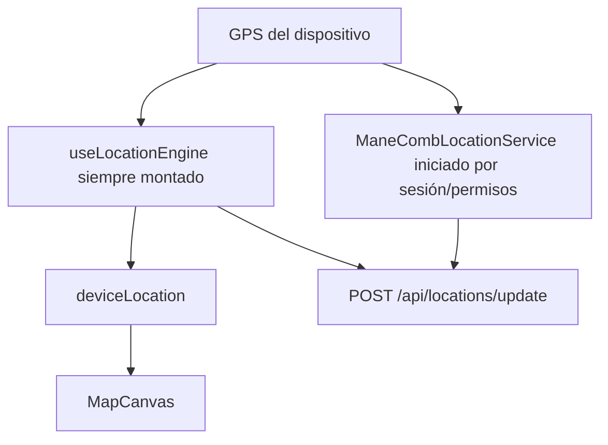
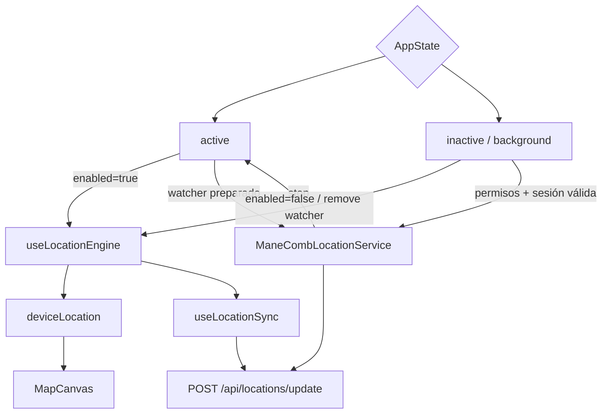

# RC-GPS-02 — Propiedad exclusiva de captura y desacoplamiento GPS/Internet

## Estado

```text
BLOCKED
```

## Objetivo

Convertir en una garantía verificable que la posición GPS local no depende de Internet, HTTP, backend o Socket.IO, y coordinar los motores existentes para que:

- `useLocationEngine` sea propietario de la captura en foreground.
- `ManeCombLocationService` sea propietario de la captura Android fuera de foreground.
- Una transición de ciclo de vida no mantenga ambos productores activos de forma prolongada.

No se crea otro motor, store, endpoint, marcador, sesión, cola o identificador.

## Base

- Rama: `main`.
- Commit inicial: `22ea01c`.
- RC-GPS-01: `RC-GPS-01.md`, estado `CLOSED`, veredicto `READY_FOR_RC_GPS_02`.
- Commit que contiene RC-GPS-01: `22ea01c`.
- Observación histórica: `22ea01c` no fue un commit documental aislado; también contiene cambios de UI anteriores. No se reescribió ni alteró ese historial.
- Entorno: Windows, Node.js, Jest, TypeScript, Gradle y Android SDK.
- APK: build debug real.
- Dispositivo runtime: no disponible. `adb devices -l` inició el daemon, pero no reportó dispositivos.

## Diagnóstico inicial

### 1. Montaje y desmontaje de `useLocationEngine`

`OperationalBackgroundServices`, montado para una sesión móvil operativa autenticada, llamaba siempre a `useLocationEngine()`. El hook iniciaba la solicitud de ubicación y el watcher en su efecto de montaje y lo retiraba únicamente al desmontarse o al refrescar.

La navegación entre pantallas no desmontaba este servicio global. El cierre de sesión o pérdida del acceso móvil sí podía desmontarlo.

### 2. Comportamiento previo ante `AppState`

`OperationalBackgroundServices` no usaba `AppState` para controlar el watcher React. Por tanto, React podía conservar su suscripción al pasar a `inactive` o `background`.

### 3. Inicio del servicio Android

El efecto de `App.tsx` iniciaba `ManeCombLocationService` cuando existían:

- Android.
- Token.
- Unidad.
- Acceso móvil.
- Permisos foreground y background.
- Para conductor, sesión `RUNNING`.

No comprobaba si la aplicación estaba visible. En consecuencia, podía iniciar el servicio nativo mientras React seguía capturando.

`map-screen.native.tsx` también solicita iniciar el servicio al comenzar o reanudar una jornada. Esta llamada se conserva porque contiene comportamiento de jornada fuera de los archivos autorizados. El bridge ahora la trata como preparación exitosa sin arrancar captura nativa cuando `AppState` es `active`; el coordinador global realiza el arranque al entregar background.

### 4. Detención previa

El servicio se detenía cuando faltaban credenciales, unidad, acceso, permisos o sesión requerida. Además, un cleanup global de `OperationalBackgroundServices` detenía el servicio en cualquier desmontaje, incluso cuando Android podía necesitar continuar.

Los flujos de cierre de sesión y limpieza operativa existentes en el store ya poseen detenciones explícitas y se conservan.

### 5. Transición previa foreground → background

No existía entrega explícita:

1. React continuaba con el watcher.
2. Android podía estar ya activo.
3. Ambos podían producir puntos con `packetId` distintos.

La idempotencia backend no podía reconocer dos capturas físicamente equivalentes con identificadores diferentes.

### 6. Transición previa background → foreground

No existía recuperación explícita porque React normalmente nunca liberaba propiedad. El servicio Android tampoco se detenía al volver a `active`.

### 7. Ventanas de captura

- Existía una ventana potencialmente indefinida con ambos motores activos.
- No se encontró una ventana diseñada donde ninguno capturara, salvo permisos, proveedor, credenciales o sesión inválidos.

### 8. Efectos de red, HTTP, token y socket

- El watcher React no consume el estado de red.
- `useLocationSync` captura el rechazo de envío sin propagarlo al motor.
- Un HTTP 500 o timeout no elimina `deviceLocation`.
- La renovación de token pertenece al servicio de sincronización/nativo y no reinicia el watcher React.
- Socket.IO actualiza las proyecciones remotas de unidades; no controla el marcador local.
- Los cambios de sesión podían reejecutar el efecto del servicio Android, pero no debían reiniciar el hook React.

## Riesgos encontrados

1. Captura React y Android simultánea durante minutos.
2. Dos puntos del mismo movimiento con IDs diferentes.
3. Inicios nativos repetidos desde el coordinador global y la pantalla de mapa.
4. Cleanup de React deteniendo tracking Android válido.
5. Ausencia de evidencia runtime sobre carreras reales de `AppState`.
6. Comportamiento de fabricantes y pantalla apagada no certificable con pruebas unitarias.

## Cambios realizados

| Archivo | Cambio |
|---|---|
| `mobile/App.tsx` | Añade observación de `AppState`, habilita React solo en `active`, inicia Android fuera de foreground y lo detiene al recuperar watcher/estado foreground |
| `mobile/src/screens/map/hooks/use-location-engine.ts` | Añade `enabled`, hace idempotente la ausencia de watcher en background y expone `watcherActive` como diagnóstico local |
| `mobile/src/native/background-location.ts` | Impide iniciar captura Android durante `active` y clasifica el propietario sin crear estado global |
| `mobile/src/native/background-location.test.ts` | Prueba bloqueo del arranque nativo en foreground y clasificación de propiedad |
| `mobile/src/screens/map/hooks/use-location-engine.test.ts` | Prueba arranque único, coordenada local y liberación del watcher al entregar background |
| `RC-GPS-02.md` | Evidencia técnica y bloqueo runtime |

No se modificó Kotlin: el bridge existente fue suficiente para coordinar la propiedad.

## Flujo anterior



El flujo anterior permitía dos productores simultáneos.

## Flujo final implementado



## Regla de propiedad

### `FOREGROUND_REACT`

- `AppState.currentState === "active"`.
- `useLocationEngine({ enabled: true })`.
- El watcher local produce `deviceLocation`.
- El bridge no arranca el servicio nativo desde llamadas de pantalla.
- Al estar preparado el watcher o resolverse su estado de permiso/error, el coordinador detiene el servicio Android.

### `BACKGROUND_ANDROID`

- `AppState.currentState !== "active"`.
- `useLocationEngine({ enabled: false })` retira su suscripción.
- El coordinador puede iniciar el servicio Android si credenciales, unidad, acceso, permisos y sesión siguen siendo válidos.

### `TRANSITIONING`

Puede existir mientras React queda preparado y Android procesa la orden de detención. No se añadió temporizador artificial ni deduplicación geoespacial. La ventana efectiva debe medirse en la prueba física antes de cerrar.

### `DISABLED`

Ningún motor produce cuando no hay permiso, proveedor, acceso, unidad o sesión requerida por las reglas actuales.

## Separación captura/sincronización

La captura:

- Solicita permisos y proveedor.
- Acepta o descarta coordenadas.
- Actualiza estado local.
- Mueve el marcador.

La sincronización:

- Evalúa conexión, horario, unidad e intervalo.
- Envía.
- Encola ante error de red.
- Reintenta mediante mecanismos existentes.

No se añadió ninguna dependencia desde captura hacia HTTP, socket o estado de cola.

## Compatibilidad

Se conservaron sin cambio:

- `/api/locations/update`.
- Payload y `packetId`.
- `RouteSession` y `RouteSessionPosition`.
- Reglas de ruta y sesión.
- Asignaciones de unidad y conductor.
- Roles, tenant y permisos.
- Socket.IO y sus salas.
- Cola AsyncStorage.
- Cola SharedPreferences.
- Modelos MongoDB.
- `MapCanvas`.
- Flujo visual del mapa.
- Inicio, pausa, reanudación y fin de jornada.

## Pruebas automatizadas

### Caracterización y propiedad

```text
mobile/node_modules/.bin/jest.cmd --runInBand
  src/native/background-location.test.ts
  src/screens/map/hooks/use-location-engine.test.ts
  src/screens/map/services/location-service.test.ts
  src/screens/map/utils/tracking.test.ts
  src/api/offline-cache.test.ts
  src/services/route-session-actions.test.ts
```

Resultado:

```text
6 suites aprobadas
33 pruebas aprobadas
0 fallos
```

Cobertura añadida:

- El watcher inicia una sola vez.
- Una coordenada válida actualiza el estado local.
- Background libera el watcher.
- Background no crea un watcher React.
- Foreground no inicia el servicio Android.
- Clasificación `FOREGROUND_REACT`.
- Clasificación `BACKGROUND_ANDROID`.
- Clasificación `TRANSITIONING`.
- Clasificación `DISABLED`.

### Suite móvil completa

```text
cd mobile
npm test
```

Resultado:

```text
Prueba punto a punto aprobada
25 suites aprobadas
126 pruebas aprobadas
0 fallos
```

La prueba nueva del hook se ejecutó en la suite dirigida porque el `test` existente enumera explícitamente sus archivos y no se modificó `package.json`.

### TypeScript

```text
cd mobile
npm run typecheck
```

Resultado: aprobado, cero errores.

### Build Android

```text
cd mobile
npm run android:debug
```

Resultado:

```text
BUILD SUCCESSFUL
623 tareas: 25 ejecutadas, 598 up-to-date
```

### Regresión backend

```text
node --require ./test/setup-env.js test/tracking-integrity.test.js
node --require ./test/setup-env.js test/route-sessions.test.js
node --require ./test/setup-env.js test/navigation-trips.test.js
```

Resultado: todas aprobadas.

Se verificaron:

- Ingesta de ubicación.
- Inicio idempotente de sesión.
- Conflictos de asignación durante sesión.
- Transiciones.
- Persistencia de posiciones.
- Duplicado del mismo `packetId`.
- Eventos.
- Visitas.
- Métricas.
- Historial.
- Viajes y duplicados exactos.

## Pruebas runtime

### Preflight

Fecha: 23 de julio de 2026.

```text
adb devices -l
```

Resultado:

- Daemon ADB iniciado.
- Cero dispositivos o emuladores conectados.
- APK debug disponible y compilada correctamente.

### Casos A–G

No ejecutados por ausencia de dispositivo:

- Foreground online.
- Foreground offline.
- Backend 500.
- Background.
- Pantalla apagada.
- Regreso a foreground.
- Cinco transiciones repetidas.

No se inventan datos de dispositivo, batería, permisos, sesión, ruta, coordenadas ni logs.

## Regresión

La evidencia automatizada confirma que no se rompieron:

- Estado local de ubicación.
- Reglas de sincronización.
- Cola offline existente.
- Bridge Android.
- Sesiones de ruta.
- Idempotencia.
- Historial y métricas.
- Tenant y permisos cubiertos por las rutas de prueba.
- Build Android.

No puede confirmarse todavía la ausencia de solapamiento real en un dispositivo.

## Riesgos pendientes

### Bloqueo de esta fase

- Medir la ventana real `TRANSITIONING`.
- Confirmar que Android toma propiedad al bloquear pantalla.
- Confirmar que React recupera propiedad al volver.
- Repetir cinco transiciones y revisar watchers, servicio y puntos.
- Confirmar visualmente que offline/500 no congelan el marcador.

### Fases posteriores

- Persistencia transaccional y migraciones.
- ACK por lotes.
- Seguimiento sin ruta.
- Límites y seguridad de colas.
- Certificación por fabricante.

## Fuera de alcance

- SQLite.
- Nuevas tablas o modelos.
- `routeId = null`.
- `FREE_TRACKING`.
- Batch sync/ACK.
- Route Learning.
- Route Candidate.
- Rediseño de mapa.
- Cambios de backend, socket, auth, tenant o permisos.
- Cambios a ventas, pagos, chat, radio o portal.

## Commit final

No creado mientras la fase permanece bloqueada por la prueba runtime obligatoria. Los cambios de RC-GPS-02 permanecen separados de los cambios backend preexistentes y deben incorporarse en un commit exclusivo únicamente después de completar los casos A–G.

Mensaje reservado:

```text
fix(tracking): coordinate foreground and background location ownership
```

## Criterios de aceptación

- [x] El desacoplamiento entre watcher y red está caracterizado.
- [x] HTTP/sincronización no gobiernan el watcher.
- [x] Socket no controla la posición local.
- [x] La propiedad estable está definida en código.
- [x] Las pruebas no acumulan watchers.
- [x] El bridge no inicia Android en foreground.
- [x] El flujo con ruta conserva contratos.
- [x] `RouteSessionPosition` e idempotencia continúan pasando.
- [x] Tenant y permisos continúan protegidos.
- [x] Pruebas mobile aprobadas.
- [x] Pruebas backend aprobadas.
- [x] TypeScript aprobado.
- [x] APK Android compilada.
- [ ] Marcador certificado online en dispositivo.
- [ ] Marcador certificado offline en dispositivo.
- [ ] HTTP 500 certificado en dispositivo.
- [ ] Handoff background certificado.
- [ ] Pantalla apagada certificada.
- [ ] Handoff foreground certificado.
- [ ] Cinco transiciones repetidas certificadas.
- [ ] Commit final aislado.

## Veredicto

```text
BLOCKED
```

La implementación y las pruebas automatizadas son satisfactorias, pero el documento rector exige bloquear si no puede ejecutarse una prueba runtime Android. No hay un dispositivo ADB conectado.

## Preparación para RC-GPS-03

```text
NOT_READY_FOR_RC_GPS_03
```

Para desbloquear:

1. Conectar un dispositivo Android autorizado por ADB.
2. Instalar la APK debug actual.
3. Ejecutar y documentar los casos A–G.
4. Corregir solo si la evidencia demuestra solapamiento, acumulación o interrupción.
5. Repetir typecheck, suite móvil, regresión backend y build.
6. Cambiar a `CLOSED` y `READY_FOR_RC_GPS_03` únicamente con evidencia.
7. Crear el commit aislado de RC-GPS-02.
