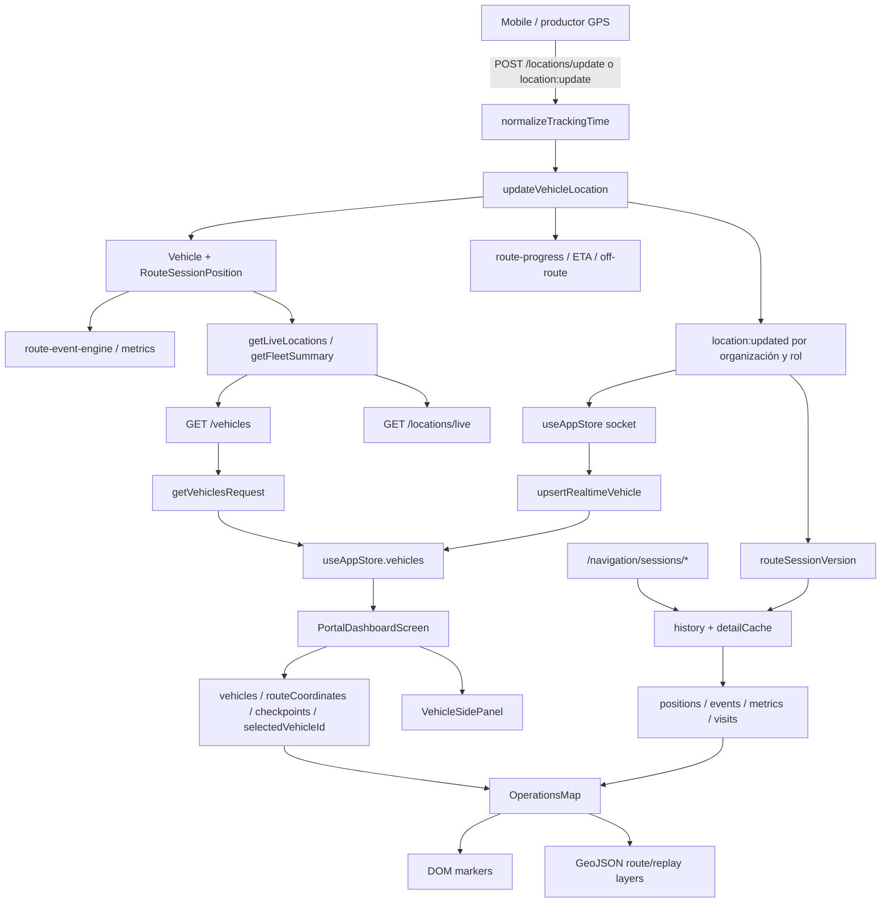

# RC-MAP-SALES-DEEP-AUDIT-01

## Alcance y método

Auditoría de solo lectura del mapa de Operaciones del Portal. No se modificó código de producto. Las conclusiones se obtuvieron mediante inspección estática de Portal, API, stores, sockets, Backend, persistencia y pruebas existentes. Se ejecutaron únicamente `tracking-integrity.test.js` y `route-sessions.test.js`; ambas finalizaron correctamente.

La validación visual dinámica de Mapbox no pudo considerarse evidencia porque no existe una prueba automatizada del componente y el entorno local autenticado no estuvo disponible. Por ello, “funciona” sólo se usa cuando existe una ruta completa de código y/o prueba; las capacidades dependientes de Mapbox en navegador se califican como parciales cuando no tienen prueba runtime.

## 1. Inventario completo

### Entrada y composición Portal

| Elemento | Responsabilidad | Evidencia |
| --- | --- | --- |
| `ventas/src/App.tsx` | Monta `PortalDashboardScreen` en `/portal` y aplica autenticación/permisos | casos de ruta alrededor de líneas 80–105 |
| `ventas/features/portal/screens/portal-dashboard-screen.tsx` | Orquesta flota, sesiones, selección, panel, historial y replay | líneas 304–748 |
| `ventas/features/portal/components/operations-map.tsx` | Adaptador Mapbox GL para flota y replay | archivo completo; props 10–23, instancia 165–211 |
| `ventas/features/portal/components/portal-layout.tsx` | Layout, carga comercial y control de acceso Portal | líneas 98–145 |
| `ventas/features/portal/components/portal-cards.tsx` | Superficies visuales compartidas | importado por la pantalla |
| `ventas/features/portal/utils/tracking.ts` | Criterio Portal de frescura GPS | líneas 3–7 |

### Estado, transporte y API Portal

| Elemento | Responsabilidad | Evidencia |
| --- | --- | --- |
| `ventas/src/store/use-app-store.ts` | Fuente de vehículos/usuarios, conexión Socket.IO y upsert realtime | líneas 84–99, 172–285, 480–494 |
| `ventas/features/portal/store/use-portal-store.ts` | Datos comerciales del Portal; no es la fuente de flota del mapa | `loadAll`, líneas 198–232 |
| `ventas/src/lib/api.ts` | Cliente REST de vehículos, historial, métricas, eventos, visitas y posiciones | líneas 294–348 |
| `ventas/src/api/client.ts` | Barrel que reexporta `src/lib/api` | archivo completo |
| `ventas/src/types/app.ts` | Contratos `Vehicle`, `ActiveRouteProgress`, `RouteSession`, `RouteEvent`, `CheckpointVisit`, `RouteSessionPosition` | líneas 125–352 |
| `socket.io-client` | Transporte realtime con websocket y fallback polling | `use-app-store.ts`, líneas 194–203 |

No existe hook específico del mapa Portal. La pantalla consume Zustand directamente y pasa props al mapa. No existe cache de tiles en aplicación; Mapbox maneja su cache internamente. El único cache explícito es `detailCache`, un `Map<string, SessionDetail>` para detalle/replay (`portal-dashboard-screen.tsx`, líneas 351 y 488–520).

### Backend y persistencia

| Elemento | Responsabilidad | Evidencia |
| --- | --- | --- |
| `backend/src/modules/vehicles/routes.js` | `GET /vehicles`, fuente REST usada por el mapa | líneas 8–14 |
| `backend/src/modules/locations/routes.js` | `GET /locations/live`, `POST /locations/update`, normalización temporal, persistencia y emisión realtime | líneas 47–207 |
| `backend/src/modules/navigation/routes.js` | Asignación de rutas, sesiones, historial, métricas, eventos, visitas y posiciones | aproximadamente líneas 560–887 |
| `backend/src/sockets/index.js` | Ingesta `location:update` por Socket.IO y emisión `location:updated` por tenant/rol | líneas 1040–1095 |
| `backend/src/services/tracking-time.js` | Normalización de relojes y frescura GPS única del Backend | líneas 1–42 |
| `backend/src/services/route-progress.js` | Cálculo de progreso, ETA, snapping y fuera de ruta | invocado por `updateVehicleLocation` |
| `backend/src/services/route-event-engine.js` | Calidad GPS y eventos de ruta | importado en `locations/routes.js`, líneas 13 y 177–181 |
| `backend/src/services/route-metrics-engine.js` | Métricas persistidas de jornadas | `locations/routes.js`, líneas 14 y 184–186 |
| `backend/src/data/mongo-store.js` | Recuperación de última posición, live snapshot, actualización monotónica, sesiones y posiciones | líneas 2279–2333, 3123–3188, 3274–3378 |
| `backend/src/data/store.js` | Implementación equivalente en memoria para pruebas/desarrollo | `getFleetSummary`, `getLiveLocations`, `updateVehicleLocation` |
| `backend/src/data/models.js` | Modelos e índices de vehículos, sesiones, posiciones, eventos y visitas | vehículo 225–231; sesiones/posiciones 244–330 |
| `backend/src/data/serializers.js` | Serialización transparente de vehículo y limpieza de asignación | líneas 79–105 |
| `backend/src/data/repositories/tracking-repository.js` | Contrato de repositorio de tracking | métodos `getLiveLocations`, `updateVehicleLocation` |
| `backend/src/services/tracking-service.js` | Fachada delegada de tracking | delega métodos del repositorio |

### Mapbox, capas y overlays

- Token: `VITE_MAPBOX_ACCESS_TOKEN`, con aliases en `operations-map.tsx:25–30`; `.env.example` lo deja vacío.
- Estilos: `navigation-preview-night-v4` con tráfico y `dark-v11` sin tráfico (`operations-map.tsx:157`).
- Controles: `NavigationControl` y `ScaleControl` (`190–191`).
- Marcadores DOM: vehículos, checkpoints y replay (`53–77`, `244–326`).
- Fuentes/capas GeoJSON: `operations-route` y `operations-replay` (`102–144`, `218–239`).
- Cámara: centro inicial, `easeTo` para un punto y `fitBounds` para varios (`179–187`, `328–344`).
- Overlay React: lista de unidades posicionada sobre el mapa en `portal-dashboard-screen.tsx:638–654`; no forma parte del canvas Mapbox.
- No existe clustering, spiderification, decluttering, geofences, popup Mapbox, hover geográfico, filtro de marcadores ni capa de incidencias en este mapa.

### Reutilización actual

`OperationsMap` se reutiliza en tres contextos:

1. Flota de Operaciones (`portal-dashboard-screen.tsx:630–638`).
2. Replay de jornada (`1197–1204`).
3. Gestión de rutas (`portal-routes-screen.tsx`, import lazy alrededor de línea 16).

## 2. Diagrama del flujo de datos

### Flujo inicial

1. `PortalDashboardScreen` llama `loadUsers()` y `loadVehicles()` al montar (`357–359`).
2. `loadVehicles` valida permisos y ejecuta `getVehiclesRequest()` (`use-app-store.ts:480–494`).
3. El cliente llama `GET /vehicles` (`src/lib/api.ts:294–296`).
4. Backend obtiene `getLiveLocations()` y filtra `live.vehicles` por tenant (`vehicles/routes.js:8–14`).
5. Mongo recupera para vehículos sin `locationTimestamp` la última `RouteSessionPosition` (`mongo-store.js:2279–2304`).
6. La pantalla pasa toda la lista de vehículos a `OperationsMap` y el seleccionado al panel.

### Flujo realtime

1. Mobile envía ubicación por HTTP o Socket.
2. Backend normaliza timestamp, calcula progreso y persiste con protección monotónica (`mongo-store.js:3123–3188`).
3. Backend añade `gpsFreshness` y emite `location:updated` a salas autorizadas (`locations/routes.js:189–200`; `sockets/index.js:1072–1094`).
4. `useAppStore` recibe el evento, extrae el vehículo y hace merge por id (`use-app-store.ts:242–273`).
5. React vuelve a renderizar mapa y panel. El mapa mueve/recrea marcadores en el efecto dependiente de `vehicles` (`operations-map.tsx:242–282`).
6. `boundsPoints` cambia y el auto-fit puede ejecutar otra transición de cámara (`328–344`).

### Flujo de sesiones/replay

1. La pantalla consulta `/navigation/sessions/history` con filtros (`portal-dashboard-screen.tsx:361–395`).
2. `openSession` solicita en paralelo métricas, eventos, visitas y primeras 800 posiciones (`488–519`).
3. El resultado se conserva en `detailCache`.
4. El replay usa posiciones ordenadas por Backend, las reduce a máximo 900 puntos para render (`downsamplePositions`) y avanza por intervalos (`559–571`).
5. Cerca del final del buffer carga otras 800 posiciones (`527–547`, `574–578`).

## 3. Estado funcional de capacidades

| Capacidad | Estado | Evidencia y límite |
| --- | --- | --- |
| Inicialización | Funciona parcialmente | Crea una sola instancia y limpia recursos (`165–211`), pero depende de token de build y no valida explícitamente soporte WebGL. Sin token entra al fallback. |
| Carga de estilos | Funciona parcialmente | Define estilos y llama `setStyle` (`157`, `213–217`). La instancia ya recibe el mismo estilo al crearse, por lo que existe una segunda carga potencial. No hay manejador `style.load` persistente para restaurar capas tras cambio de estilo. |
| Tiles | Funciona parcialmente | Mapbox los carga externamente. Cualquier evento `error` marca todo el mapa como no disponible (`188–189`), sin distinguir fallo transitorio de tile, token o WebGL. No hay prueba runtime. |
| Cámara | Funciona parcialmente | Centro inicial y fit automático existen. No hay API imperativa para centrar selección y el fit incluye toda la flota, ruta y checkpoints. |
| Zoom | Funciona | Mapa interactivo y `NavigationControl` con zoom (`184`, `190`). Sin prueba E2E. |
| Selección de unidad | Funciona parcialmente | Click de marcador llama el callback con la última versión del vehículo (`255–264`). La selección también cambia el filtro de historial, acoplando dos responsabilidades (`dashboard:446–452`). |
| Actualización de posición | Funciona | Socket hace upsert y el efecto mueve el marker (`use-app-store:266–273`; mapa `269–274`). Backend protege contra timestamps regresivos (`mongo-store:3173–3184`). |
| Seguimiento | No funciona como seguimiento de cámara | No existe modo follow, ref pública ni suscripción a seleccionado. “Centrar unidad” ejecuta `openVehicle(selectedVehicle)` (`dashboard:676`), pero no llama `easeTo` ni cambia una prop que fuerce cámara. |
| Marcadores | Funciona parcialmente | Alta, actualización y baja por id están implementadas. Un vehículo se dibuja sólo con `locationTimestamp`, aunque esté stale (`getVehiclePoint`, líneas 80–82); no representa frescura, rumbo, estado ni clustering. |
| Polylines | Funciona parcialmente | Ruta y replay usan GeoJSON. Sólo se renderizan con >=2 puntos. No existe recuperación robusta tras `setStyle`; tampoco segmentación por estado o dirección. |
| Rutas | Funciona parcialmente | `getRouteGeometry` usa snapshot asignado y fallback origen/destino (`dashboard:278–290`). Si falta polyline se muestra una recta, no una ruta vial. |
| Overlays | Funciona parcialmente | Lista de unidades existe como overlay React. No hay prevención de colisión con controles Mapbox ni adaptación basada en viewport/cantidad. |
| Capas | Funciona parcialmente | Dos capas lineales y marcadores DOM. No hay clustering, incidentes ni capas operacionales de estado. |
| Eventos | Funciona parcialmente | Eventos se cargan al abrir sesión y se muestran en timeline. Después de cambiar a una unidad sin sesión cargada, `sessionDetail` puede conservar eventos anteriores porque no se limpia en `openVehicle`. |
| Filtros | Funciona parcialmente | Los filtros aplican a historial, no a entidades del mapa. No existe criterio de visibilidad de marcadores por estado. |
| Sincronización panel | Funciona parcialmente | Vehículo y marcador comparten objeto de store. Sesión/eventos provienen de otra consulta y pueden quedar desfasados; `recentEvents={sessionDetail?.events || []}` no comprueba `vehicleId`. |
| Cambio de unidad | Funciona parcialmente | Actualiza selección, ruta y filtro. Al filtrar historial a una unidad, `sessionsByVehicle` pierde contexto de las demás; sus badges del overlay dejan de disponer de sesión activa hasta otra carga. |
| Actualización automática | Funciona parcialmente | Ubicación actualiza por socket. No hay polling de respaldo. `route-session:updated` incrementa versión y recarga historia, pero no actualiza directamente sesión/panel. |
| Reconexión | Funciona parcialmente | Socket reintenta infinitamente con backoff (`use-app-store:198–201`). Al reconectar sólo llama `usePortalStore.loadAll()` (`219–222`), que carga datos comerciales, no `useAppStore.loadVehicles`; eventos perdidos no se recuperan necesariamente hasta otro update o remount. |
| Estados vacíos | Funciona | Hay fallback diferenciado para token/fallo, flota sin posición y replay sin posiciones (`operations-map:340–395`), además de vacíos de historial/detalle. |
| Errores | Funciona parcialmente | API expone mensaje y Mapbox tiene fallback, pero el handler global de error es binario/permanente y no existe retry/recovery del mapa. |

## 4. Hallazgos con evidencia

### H1 — La carga inicial del Portal carece de `gpsFreshness` (Alto)

`GET /vehicles` devuelve `filterTenantList(req.user, live.vehicles)` sin enriquecer frescura (`vehicles/routes.js:8–14`). `getLiveLocations()` y `getFleetSummary()` tampoco agregan ese campo (`mongo-store.js:2279–2333`). En cambio, `/locations/live` sí llama `buildGpsFreshness` (`locations/routes.js:47–64`) y cada `location:updated` también lo agrega (`189`).

Consecuencia: después de recargar el Portal, `isVehicleGpsFresh` devuelve falso si `gpsFreshness.freshUntil` no existe (`portal/utils/tracking.ts:3–6`), aunque la ubicación sea reciente. El panel puede indicar GPS perdido hasta recibir el siguiente evento.

### H2 — El marker no respeta frescura GPS (Alto)

`getVehiclePoint` sólo exige coordenadas válidas y `locationTimestamp` (`operations-map.tsx:80–82`). Por tanto, una última posición recuperada desde una jornada antigua se dibuja igual que una posición actual. El panel y el mapa pueden comunicar estados distintos para el mismo dato.

### H3 — “Centrar unidad” no centra (Alto)

La acción está conectada a `openVehicle(selectedVehicle)` (`dashboard:676`). Esta función sólo selecciona, filtra historial y abre sesión (`446–452`). La única cámara está dentro del auto-fit del mapa (`operations-map:328–344`) y no existe ref/comando para centrar. Si la geometría no cambia, `fittedKeyRef` evita cualquier movimiento.

### H4 — Auto-fit sobre cada actualización puede producir cámara inestable (Alto)

`boundsPoints` depende de todas las coordenadas de `vehicles` (`159–162`). Cada evento reemplaza/mergea el vehículo y cambia coordenadas; el efecto construye un `fitKey` nuevo y ejecuta `fitBounds` durante 450 ms (`328–344`). Con frecuencia GPS alta, la cámara intenta reajustarse repetidamente y prioriza toda la flota sobre la unidad seleccionada.

### H5 — Reconexión incompleta (Alto)

Socket tiene backoff robusto, pero `reconnect` llama `usePortalStore.loadAll()` (`use-app-store:219–222`). `loadAll` recupera overview, suscripción, onboarding, activaciones, facturas y sesiones de cuenta (`use-portal-store:198–232`), no `useAppStore.vehicles` ni historial de rutas. No existe polling. Una posición perdida durante desconexión no se concilia de forma determinista.

### H6 — Historial, selección y estado operacional están acoplados (Alto)

`openVehicle` modifica `filters.vehicleId` (`dashboard:446–448`). Esa dependencia vuelve a consultar historia limitada a la unidad (`395`). `sessionsByVehicle` se deriva únicamente de `history` (`402–413`), por lo que seleccionar una unidad elimina de memoria el contexto de sesión de las demás. El overlay usa ese mapa para sus estados (`646–647`).

### H7 — Eventos recientes pueden pertenecer a otra unidad (Crítico de integridad visual)

El panel recibe `sessionDetail?.events` sin validar sesión/vehículo (`dashboard:664`). `openVehicle` no limpia `sessionDetail`. Si la nueva unidad no resuelve inmediatamente una sesión, el panel puede mostrar eventos del detalle anterior. Es una inconsistencia de representación; no implica fuga Backend porque los endpoints validan acceso, pero sí atribución incorrecta dentro del mismo tenant.

### H8 — Ciclo de estilo/capas frágil (Medio)

El mapa nace con `style: mapStyle` (`184`) y otro efecto llama `map.setStyle(mapStyle)` (`213–217`). Las capas personalizadas se sincronizan sólo cuando cambian `replayPath` o `routeCoordinates`; si el estilo cambia, Mapbox elimina sources/layers y no existe listener permanente de `style.load` que las restaure.

### H9 — Cualquier error Mapbox degrada permanentemente todo el mapa (Medio)

`map.on('error', handleMapError)` y `handleMapError` ejecuta `setMapUnavailable(true)` (`188–189`). No clasifica errores recuperables de tiles ni reintenta. Un fallo parcial puede sustituir todo el mapa durante la vida del componente.

### H10 — Escalabilidad limitada por markers DOM y fit global (Medio/Alto)

Cada vehículo usa un elemento DOM y un `Marker` independiente (`244–282`), sin clustering ni capa symbol. Cada actualización recorre toda la flota y también reconstruye bounds. Es adecuado para flotas pequeñas, pero escala peor que sources/layers batch.

### H11 — Replay downsamplea visualmente pero mantiene carga/cache creciente (Medio)

Las posiciones se cargan en páginas de 800 y se concatenan en `sessionDetail`; el mapa recibe un downsample máximo de 900, lo cual protege el render, pero el cache conserva todas las posiciones y no tiene límite/evicción. Varias jornadas largas pueden aumentar memoria durante una sesión Portal.

### H12 — Ausencia de pruebas frontend GIS (Alto)

No hay tests para `OperationsMap`, marcador, source/layer, estilo, cámara, selección, reconexión Portal ni sincronización panel. `tracking-integrity.test.js` y `route-sessions.test.js` validan Backend y pasaron, pero no cubren Mapbox ni React.

## 5. Diferencias contra el diseño objetivo

| Dimensión | Referencia | Estado actual y causa |
| --- | --- | --- |
| Experiencia | Centro de monitoreo vivo y estable | Datos realtime existen, pero la cámara global puede moverse continuamente y no hay follow real. |
| Jerarquía | Unidad seleccionada domina mapa y panel | El mapa ajusta toda la flota/ruta; no prioriza seleccionado. |
| Interacción | Centrar, seleccionar y recibir feedback inmediato | Selección funciona; “Centrar” no ejecuta cámara y no hay loading/feedback geográfico. |
| Densidad | Overlay compacto con estado fiable | Overlay existe, pero sus sesiones dependen del historial filtrado y puede perder contexto. |
| Marcadores | Estados visuales diferenciados | Sólo seleccionado/no seleccionado; no freshness, detenido, fuera de ruta ni dirección. |
| Navegación | Cámara predecible | Auto-fit reacciona a cada cambio de coordenadas. |
| Overlays | Controles/map overlays coordinados | Overlay React puede solaparse con atribución/escala/controles y no responde a cantidad. |
| Estados | Fresh/stale/lost coherentes | Inicial `/vehicles` no incluye frescura y marker ignora frescura. |
| Feedback | Reconexión y actualización visibles | `socketStatus` existe en store, pero la pantalla no lo muestra ni reconcilia flota al reconectar. |
| Fluidez | Movimiento/follow controlado | Marcadores saltan a nueva coordenada; no interpolación. Auto-fit puede competir con interacción manual. |
| Timeline | Eventos de unidad seleccionada | Puede conservar eventos de la unidad anterior. |

## 6. Reutilización y responsabilidades

### Debe reutilizarse

- Normalización temporal y `buildGpsFreshness` del Backend.
- Persistencia monotónica de `updateVehicleLocation`.
- Segmentación Socket por organización/rol y guards de endpoints.
- `useAppStore` como fuente de flota Portal.
- `OperationsMap` como único adaptador Mapbox, evitando un segundo mapa.
- Snapshots `assignedRoute`, progreso, ETA y geometría existente.
- Endpoints y cache de sesiones/replay.
- `StatusBadge`, panel y timeline existentes.

### No debe tocarse sin evidencia adicional

- Contratos públicos de GPS/sesiones.
- Engines de progreso, eventos y métricas, que están cubiertos por pruebas Backend.
- Guards de tenant/RBAC.
- Protección monotónica y normalización temporal.
- Modelo de sesión/posición e índices existentes.

### Duplicación o divergencia

- Frescura se construye en `/locations/live` y en dos rutas de actualización, pero no en `/vehicles`.
- HTTP y Socket duplican ingestión/emisión de ubicación (`locations/routes.js` y `sockets/index.js`). Comparten helpers temporales, pero el pipeline de sesión/eventos sólo está completo en HTTP: el handler socket actualiza vehículo y emite, pero no crea `RouteSessionPosition` ni procesa eventos. Esto es una divergencia funcional crítica si Mobile usa Socket como transporte GPS efectivo.
- Geometría/labels/progreso se adaptan nuevamente en helpers de pantalla aunque parte ya existe en `assignedRoute` y `activeRouteProgress`.
- `OperationsMap` combina lifecycle Mapbox, creación visual de markers, sources, cámara y fallback en un solo componente.

### Código muerto o de efecto nulo observado

- `variant` sólo influye en el texto/icono del fallback; no modifica el comportamiento Mapbox normal.
- `onClickPoint` se soporta en `OperationsMap`, pero Operaciones no lo pasa; es útil para la pantalla de rutas, no está muerto globalmente.
- El segundo `setStyle(mapStyle)` inicial es potencialmente redundante, no necesariamente muerto.
- “Centrar unidad” tiene efecto de reselección pero no cumple su semántica de cámara.

### Responsabilidades mal ubicadas

- Selección de unidad no debería ser también filtro destructivo del dataset usado para estados operacionales.
- La política de cámara está implícita en cambios de props, no modelada como intención (fit inicial, fit ruta, follow, center manual).
- El panel acepta eventos sin identidad de sesión/vehículo.
- El componente Mapbox decide que cualquier error hace el mapa indisponible.
- La reconexión del socket comercial no coordina la reconciliación de la fuente de flota.

### Cambios que serían únicamente visuales

- Tipografía, sombras, radios, densidad y posición del overlay.
- Forma/iconografía de markers, siempre que no se altere su semántica.
- Orden y compactación de secciones del panel.

Las correcciones de frescura, cámara, reconciliación y atribución de eventos no son sólo visuales; requieren ajustes de integración cuidadosamente acotados.

## 7. Riesgos clasificados

| Riesgo | Nivel | Impacto |
| --- | --- | --- |
| Eventos de sesión anterior mostrados para la unidad actual | Crítico | Decisión operativa basada en información atribuida incorrectamente |
| Transporte Socket no persiste posiciones/eventos como el HTTP | Crítico | Replay/métricas incompletos según transporte usado |
| Frescura ausente en carga inicial `/vehicles` | Alto | GPS falsamente perdido tras recarga |
| Marker ignora freshness | Alto | Posición antigua visualizada como viva |
| Reconexión sin recarga de flota/historial | Alto | Estado obsoleto indefinido tras corte |
| Acción “Centrar” sin control de cámara | Alto | Función declarada que no cumple |
| Auto-fit en cada ubicación | Alto | Jitter, pérdida de contexto e interacción frustrante |
| Dataset de sesiones acoplado a filtros | Alto | Estados de otras unidades desaparecen o degradan |
| Ausencia de pruebas frontend Mapbox | Alto | Regresiones GIS no detectadas |
| DOM markers sin clustering | Medio/Alto | Degradación con flotas grandes |
| Restauración de capas tras estilo | Medio | Polylines desaparecen al alternar estilo |
| Error Mapbox global y permanente | Medio | Fallo parcial degrada toda la vista |
| Cache de replay sin evicción | Medio | Crecimiento de memoria en uso prolongado |
| Sin interpolación de marker | Medio | Movimiento visual brusco |
| Token sólo en build y `.env.example` vacío | Medio | Despliegue válido pero mapa en fallback por configuración |
| Overlay sin gestión de colisiones | Bajo/Medio | Controles ocultos en viewport pequeño |

## 8. Acciones priorizadas para nivel producción

Estas son recomendaciones, no implementaciones.

1. **P0 — Unificar semántica del pipeline de ubicación por transporte.** Confirmar qué transporte usa Mobile en producción y asegurar que HTTP/Socket producen las mismas posiciones, eventos, métricas y decisiones temporales. Justificación: divergencia comprobada entre handlers.
2. **P0 — Garantizar identidad de eventos del panel.** Asociar el detalle visible explícitamente con `selectedVehicleId/selectedSessionId` y nunca renderizar datos de otra selección.
3. **P0 — Entregar frescura consistente en la fuente `/vehicles`.** Reutilizar `buildGpsFreshness`; no crear otra regla.
4. **P1 — Modelar intenciones de cámara.** Separar fit inicial, fit de ruta, center manual y follow seleccionado; evitar auto-fit por cada posición.
5. **P1 — Reconciliar tras reconexión.** Recargar vehículos e historial/sesión activa desde fuentes existentes al reconectar.
6. **P1 — Desacoplar dataset operacional de filtros de historial.** Mantener estados de toda la flota aunque se consulte historia de una unidad.
7. **P1 — Aplicar freshness a representación del marker.** Mostrar stale/missing coherentemente con el panel, sin ocultar necesariamente la última posición auditiva.
8. **P1 — Añadir pruebas frontend del adaptador GIS.** Lifecycle, marker upsert/remove, layers, camera policy, selección, fallback y style reload.
9. **P2 — Restaurar custom layers en `style.load` y clasificar errores Mapbox.** Evitar pérdida de polylines y fallback permanente por errores transitorios.
10. **P2 — Evaluar source/layer batch y clustering según cardinalidad real.** Sólo si métricas de flota justifican el cambio.
11. **P2 — Limitar/evictar cache de replay.** Preservar paginación y downsample existentes.
12. **P3 — Ajustar overlays y microinteracciones.** Después de resolver integridad y cámara.

## 9. Preparación real del módulo

**Preparación estimada: 58%.**

Desglose ponderado:

- Backend temporal, persistencia y aislamiento: **82%**. Existen normalización, protección monotónica, rooms por tenant y pruebas.
- Ingesta consistente entre transportes: **45%**. HTTP tiene pipeline completo; Socket no evidencia persistencia de sesión/eventos.
- Fuente realtime Portal y reconexión: **55%**. Upsert funciona, reconciliación no.
- Render GIS básico: **70%**. Mapa, marcadores, rutas, checkpoints, controles y fallback existen.
- Cámara/seguimiento operacional: **35%**. No hay follow ni center real; auto-fit es global/reactivo.
- Consistencia mapa–panel–sesiones: **45%**. Comparte vehículo, pero hay desacople de freshness, filtros y eventos.
- Replay: **75%**. Paginación, cache y downsample existen y Backend está probado; falta QA frontend/memoria.
- Escalabilidad/observabilidad/pruebas frontend: **35%**.

El porcentaje no significa que 42% deba reescribirse. La mayor parte del déficit está concentrada en integración, política de cámara, reconciliación y pruebas.

## 10. Conclusión

**No es necesaria una reescritura del mapa ni de la arquitectura general.** El componente Mapbox, los datos de vehículo, los snapshots de ruta, la persistencia temporal, Socket.IO y el replay constituyen una base reutilizable.

Sí son necesarias correcciones acotadas antes de considerarlo producción robusta:

- corregir la divergencia HTTP/Socket del pipeline de tracking;
- corregir la atribución de eventos y la frescura inicial;
- reorganizar la política de cámara para que “centrar” y seguimiento sean reales;
- reconciliar flota/sesiones tras reconexión;
- desacoplar estados operacionales de filtros históricos;
- reforzar lifecycle de capas/errores y pruebas GIS.

La reorganización visual por sí sola no puede resolver estos problemas porque varios son de integridad y sincronización. Tampoco se justifica reemplazar Mapbox, Zustand, endpoints o modelos: la evidencia muestra que los fallos están en las fronteras entre componentes existentes, no en la ausencia de una arquitectura funcional.

## Evidencia de pruebas ejecutadas

- `node --require ./test/setup-env.js test/tracking-integrity.test.js` — **PASS**.
- `node --require ./test/setup-env.js test/route-sessions.test.js` — **PASS**; cubrió inicio/fin idempotente, transiciones, ingestión HTTP, eventos, visitas, posiciones, historial y métricas.
- No existe suite frontend para `OperationsMap`; las capacidades Mapbox permanecen sin evidencia automatizada runtime.

