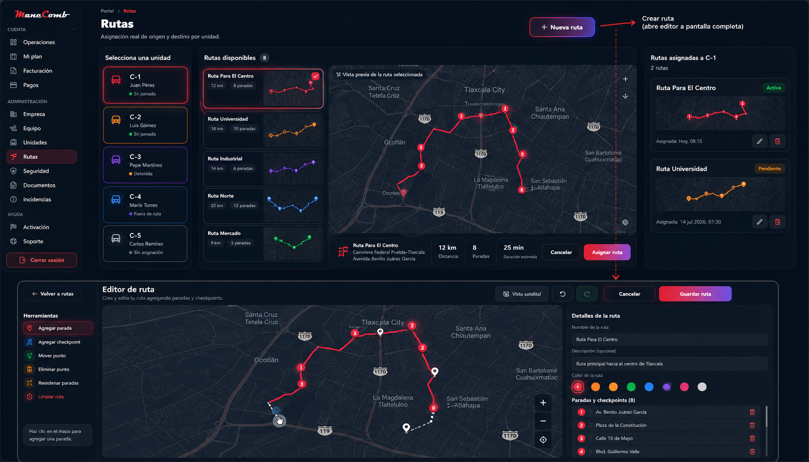
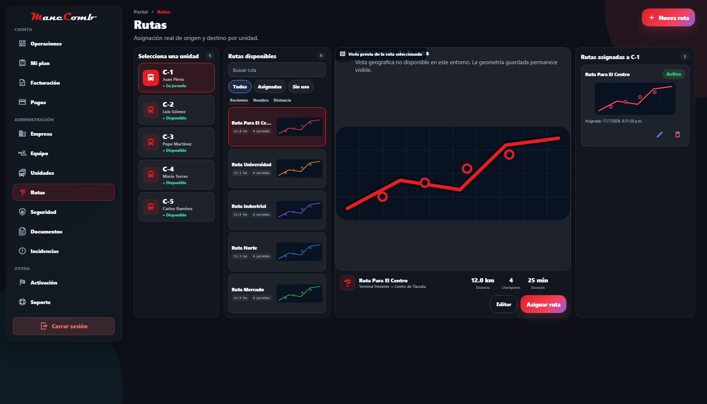

# RC-RUTAS-UI-PARITY-01

## Alcance

Esta RC modifica exclusivamente la arquitectura visual del módulo Rutas. No cambia backend, API, stores, hooks, modelos, servicios, motor GIS, recálculo, drag & drop, persistencia, catálogo ni flujo funcional.

## Evidencia visual

| Referencia | Implementación renderizada |
| --- | --- |
|  |  |

La captura del resultado se genera desde el build real con `scripts/capture-routes-ui-parity.js`. El script sustituye únicamente respuestas HTTP durante la captura para obtener datos representativos; no modifica código, estado persistente ni comportamiento de producción.

## Comparación bloque por bloque

| Bloque | Referencia | Resultado y justificación |
| --- | --- | --- |
| Encabezado | Título compacto y acción primaria separada | `PortalLayout` usa `compact`, `wide` y su área nativa de acciones. “Nueva ruta” permanece fuera del flujo de asignación. |
| Unidades | Columna izquierda de tarjetas verticales | Columna fija y densa, con código dominante, conductor, estado e indicador inequívoco de selección. Permite escanear la flota sin consumir el centro. |
| Catálogo | Columna compacta, no cuadrícula | Lista vertical de tarjetas de 76 px; la miniatura geométrica ocupa aproximadamente la mitad de cada tarjeta. Búsqueda, filtros y ordenamiento permanecen disponibles en formato compacto. |
| Vista previa | Mapa central protagonista | La columna central recibe el mayor `flex`, un mínimo de 500 px de alto y conserva `OperationsMap`. Cuando Mapbox no está disponible se mantiene visible la geometría real en vez de sustituirla por texto. |
| Barra inferior | Identidad, métricas y acciones en una franja | Nombre, recorrido, distancia, checkpoints, duración, editar y asignar se agrupan una sola vez debajo del mapa. No se duplica información. |
| Asignadas | Panel lateral derecho | El panel usa exclusivamente `selectedVehicle.assignedRoute`: estado, miniatura, fecha y acciones existentes de editar/liberar. No introduce historial ni nuevas entidades. |
| Editor | Herramientas, mapa y detalles | Conserva tres paneles, pero adopta los mismos bordes, radios, densidad y acciones superiores del catálogo. El mapa continúa siendo la superficie dominante. |
| Espaciado | Alta densidad operativa | Separaciones de 6–10 px, tarjetas bajas, paneles de 10–12 px de padding y ausencia de espacios muertos. Los mínimos flexibles conservan legibilidad al envolver. |
| Microinteracciones | Sutiles y coherentes | Hover, foco, selección, borde, opacidad y elevación usan las transiciones existentes de 150–220 ms y respetan `prefers-reduced-motion`. |

## Componentes reutilizados

- `PortalLayout` para navegación, encabezado, acción principal, ancho y densidad.
- `OperationsMap` para vista previa y editor GIS.
- `RouteGeometryThumbnail` para miniaturas derivadas de la geometría real.
- `StatusBadge`, `EmptyState` y `ConfirmModal` para estados, vacíos y confirmaciones.
- `useAppStore`, `assignRoute`, `clearRouteAssignment`, `SavedRoute`, `Vehicle`, `AssignedRoute` y todos los handlers existentes.

## Componentes únicamente reorganizados

- Selector de unidades: de fila segmentada a columna operativa.
- Catálogo: de grid flexible a lista compacta.
- Vista previa y métricas: de bloques separados a mapa con barra inferior.
- Ruta asignada: de lista general oculta a panel contextual de la unidad seleccionada.
- Acciones del editor: de pie del panel a encabezado compartido con el catálogo.

## Confirmación funcional

- La selección de unidad sigue actualizando `editor.vehicleId`.
- La selección de ruta sigue actualizando `selectedRouteId`.
- Asignar continúa ejecutando el handler existente y `/navigation/assign`.
- Editar continúa abriendo el editor existente con la misma ruta.
- Liberar continúa usando `clearRouteAssignment` y su confirmación.
- Drag & drop, edición de checkpoints, movimiento de marcadores e inserción por segmento permanecen sin cambios.
- El recálculo automático conserva `planSavedRouteRequest` y el debounce existente.
- No se modificó ningún archivo de backend en esta RC.

## Validación

- TypeScript: `npm.cmd run typecheck`.
- Producción: `npm.cmd run build`.
- Integridad del diff: `git diff --check`.
- Evidencia visual reproducible: `node scripts/capture-routes-ui-parity.js`.
- Responsive: las cuatro columnas usan `flexBasis`, mínimos seguros y `flexWrap`; el editor mantiene el mismo comportamiento.
- Accesibilidad básica: roles, labels, `accessibilityState`, foco visible y reducción de movimiento.
