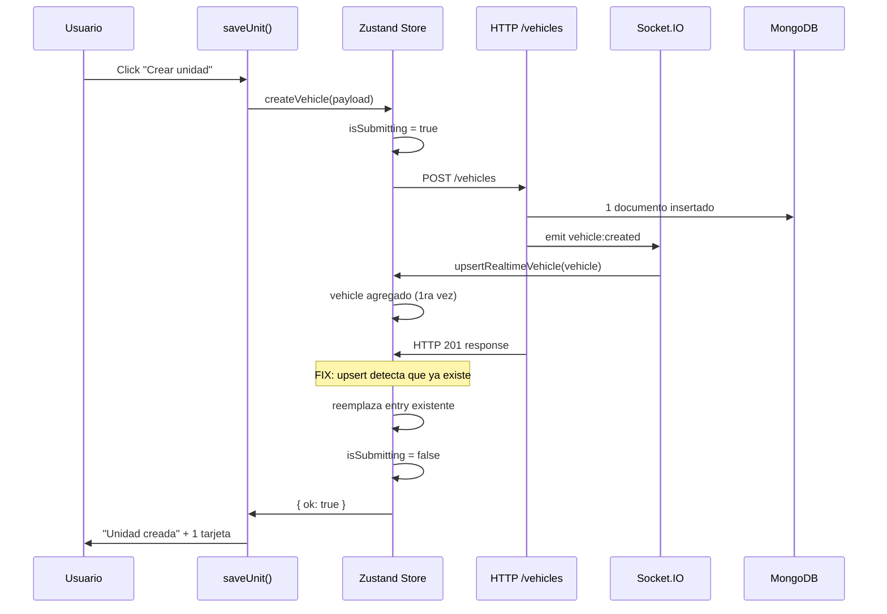

# RC-UNITS-DUPLICATE-CREATE-01: Duplicación de unidades al crearlas en el Portal

## Resumen

Al hacer clic en "Crear unidad" en `/portal/unidades`, aparecen **dos tarjetas idénticas** en la lista. La causa raíz es una **condición de carrera (race condition)** entre el evento Socket.IO `vehicle:created` (push) y la respuesta HTTP `POST /vehicles` (request/response). Solo se inserta **1 documento en MongoDB** y solo sale **1 request HTTP** del navegador, pero el store de Zustand termina con **2 entradas idénticas**, lo que produce 2 cards en el render.

---

## Trazabilidad completa

### Capa 1: UI — `portal-units-screen.tsx`

| Paso | Archivo | Línea | Evento |
|------|---------|-------|--------|
| 1 | `portal-units-screen.tsx` | 217 | `onPress={() => void saveUnit()}` en `<Pressable>` |
| 2 | `portal-units-screen.tsx` | 122-154 | `saveUnit()`: valida campos, construye payload |
| 3 | `portal-units-screen.tsx` | 144 | `createVehicle(payload)` (Zustand action) |

El botón tiene `disabled={isSubmitting}` pero **`saveUnit()` no verificaba `isSubmitting` antes de llamar a `createVehicle`**.

### Capa 2: Store — `use-app-store.ts`

| Paso | Archivo | Línea | Evento |
|------|---------|-------|--------|
| 4 | `use-app-store.ts` | 562-569 | `createVehicle`: chequea `isSubmitting` (false), lo setea a `true` |
| 5 | `use-app-store.ts` | 572 | `await createVehicleRequest(payload)` — request HTTP |
| 6 | `use-app-store.ts` | 573 | Tras respuesta HTTP: `set({ vehicles: [vehicle, ...state.vehicles] })` |

**El problema**: en el paso 6 se hace un prepend ciego sin verificar si el vehículo ya existe en el store.

### Capa 3: HTTP — `api.ts`

| Paso | Archivo | Línea | Evento |
|------|---------|-------|--------|
| 7 | `api.ts` | 298-299 | `createVehicleRequest` → `apiClient.post('/vehicles', payload)` |

**Solo 1 request HTTP** sale del navegador. El guard `isSubmitting` de Zustand es síncrono y efectivo contra dobles clicks.

### Capa 4: Backend — `routes.js`

| Paso | Archivo | Línea | Evento |
|------|---------|-------|--------|
| 8 | `routes.js` | 40-46 | `store.createVehicle({...})` — inserta en MongoDB |
| 9 | `routes.js` | 48-54 | **Emite `vehicle:created` por socket.IO** |
| 10 | `routes.js` | 56-59 | Retorna HTTP 201 con `{ ok: true, data: vehicle }` |

**El emisor de socket (paso 9) se ejecuta ANTES de responder HTTP (paso 10)**. Esto es clave.

### Capa 5: MongoDB — `mongo-store.js`

| Paso | Archivo | Línea | Evento |
|------|---------|-------|--------|
| 11 | `mongo-store.js` | 2591-2619 | `VehicleModel.create({...})` — 1 documento insertado |

### Capa 6: Socket (cliente) — `use-app-store.ts`

| Paso | Archivo | Línea | Evento |
|------|---------|-------|--------|
| 12 | `use-app-store.ts` | 266-273 | Socket recibe `vehicle:created` → `extractVehicleFromRealtimePayload` |
| 13 | `use-app-store.ts` | 89-97 | `upsertRealtimeVehicle`: chequea si `vehicle.id` existe; si no, lo agrega |

---

## Causa raíz

**Race condition entre socket y HTTP**:

1. Backend emite `vehicle:created` por socket **antes** de responder el HTTP 201 (routes.js:48 → routes.js:56)
2. El socket (WebSocket) viaja más rápido que la respuesta HTTP, por lo que **llega al cliente primero**
3. `upsertRealtimeVehicle` (paso 13) agrega el vehículo al store — correcto, primera vez
4. La respuesta HTTP resuelve → `createVehicle` (paso 6) **vuelve a agregar el mismo vehículo** sin verificar si ya existe
5. El store termina con `[vehicle, vehicle]` (2 entradas con el mismo `id`)
6. React renderiza 2 `<View key={vehicle.id}>` → el usuario ve 2 tarjetas idénticas

### Conteo real por capa

| Capa | Ejecuciones | ¿Correcto? |
|------|-------------|------------|
| `saveUnit()` | 1 | ✅ |
| `createVehicle()` (store) | 1 | ✅ |
| Request HTTP `POST /vehicles` | 1 | ✅ |
| Llegada al endpoint backend | 1 | ✅ |
| Inserciones en MongoDB | 1 | ✅ |
| **Entradas en el store** | **2**  | ❌ |
| **Tarjetas renderizadas** | **2**  | ❌ |

No es un doble clic, no es un doble evento, no es React Query. El bug es **exclusivamente que el store no maneja la idempotencia cuando el socket ya insertó el registro**.

---

## Fix aplicado

### Fix 1 (causa raíz): Upsert en `createVehicle` del store

**Archivo**: `ventas\src\store\use-app-store.ts:572-580`

**Antes**:
```typescript
set((state) => ({ vehicles: [vehicle, ...state.vehicles] }));
```

**Después**:
```typescript
set((state) => {
  const exists = state.vehicles.some((entry) => entry.id === vehicle.id);
  return {
    vehicles: exists
      ? state.vehicles.map((entry) => (entry.id === vehicle.id ? { ...entry, ...vehicle } : entry))
      : [vehicle, ...state.vehicles],
  };
});
```

Esto replica la misma lógica de `upsertRealtimeVehicle`. Si el vehículo ya fue agregado por el socket, lo reemplaza en lugar de duplicarlo. Si el HTTP llegó primero (caso borde), lo agrega normalmente.

### Fix 2 (defensa en profundidad): Guard `isSubmitting` en `saveUnit`

**Archivo**: `ventas\features\portal\screens\portal-units-screen.tsx:123`

**Antes**:
```typescript
const saveUnit = async () => {
  setMessage(null);
```

**Después**:
```typescript
const saveUnit = async () => {
  if (isSubmitting) return;
  setMessage(null);
```

Esto evita que el handler del botón siquiera llegue al store si ya hay una operación en curso, como defensa adicional contra dobles disparos.

---

## Verificación

Para comprobar que el fix funciona, se puede agregar logging temporal:

```typescript
// En saveUnit:
console.log('[saveUnit] ejecutado', Date.now());

// En createVehicle (store):
console.log('[createVehicle] store action', Date.now());

// En createVehicleRequest (api.ts):
console.log('[HTTP] POST /vehicles', Date.now());

// En la respuesta HTTP (backend routes.js):
console.log('[Backend] vehicle created', vehicle._id);

// En upsertRealtimeVehicle:
console.log('[Socket] vehicle:created received', vehicle.id, 'exists:', exists);
```

Con el fix, el flujo esperado es:

1. `saveUnit` → 1 ejecución
2. `createVehicle` (store) → 1 ejecución  
3. `POST /vehicles` → 1 request HTTP
4. Backend → 1 inserción en MongoDB
5. Socket `vehicle:created` → `upsertRealtimeVehicle` → upserts en store
6. Respuesta HTTP → `createVehicle` → **detecta que ya existe** → reemplaza en lugar de duplicar
7. Store: 1 entrada → 1 tarjeta renderizada



---

## Lecciones

1. **El orden backend importa**: emitir eventos socket antes de la respuesta HTTP crea una ventana donde el cliente recibe el dato dos veces por canales distintos.
2. **Idempotencia en el store**: cualquier acción que agregue datos desde una fuente externa (HTTP, socket) debe verificar existencia previa (upsert).
3. **Defensa en capas**: el guard en `saveUnit` + el guard en el store + el upsert forman una barrera triple contra duplicados.
